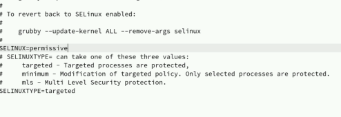
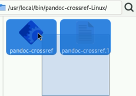

---
## Front matter
lang: ru-RU
title: Лабораторная работа 1
subtitle: Отчет
author:
  - Власов Артем Сергеевич
institute:
  - Российский университет дружбы народов, Москва, Россия
  - Объединённый институт ядерных исследований, Дубна, Россия
date: 27 февраля 2025

## i18n babel
babel-lang: russian
babel-otherlangs: english

## Formatting pdf
toc: false
toc-title: Содержание
slide_level: 2
aspectratio: 169
section-titles: true
theme: metropolis
header-includes:
 - \metroset{progressbar=frametitle,sectionpage=progressbar,numbering=fraction}
---

# Информация

## Докладчик

:::::::::::::: {.columns align=center}
::: {.column width="70%"}

  * Власов Артем Сергеевич
  * Группа НПИбд-01-24
  * Студент
  * Российский университет дружбы народов
  * [1132246841@pfur.ru](mailto:1132246841@pfur.ru)

## Цели и задачи

Приобретение навыков установки операционной системы на виртуальную машину и ее настройка для дальнейшей работы.

# Задание

Установка Fedora Sway на вирутальную машину и ее настройка.

                                                      

# Выполнение лабораторной работы

## Создаем новую виртуальную машину, указываем имя, выбираем диск,производим настройку

:::::::::::::: {.columns align=center}
::: {.column width="70%"}

{#fig:001 width=70%}

{#fig:002 width=70%}

{#fig:003 width=70%}
:::
::::::::::::::

## Устанавливаем необходимые инструменты

:::::::::::::: {.columns align=center}
::: {.column width="70%"}

{#fig:004 width=70%}

:::
::::::::::::::

## Подключение образа диска дополнений

:::::::::::::: {.columns align=center}
::: {.column width="70%"}

{#fig:005 width=70%}

{#fig:006 width=70%}

:::
::::::::::::::

## Подключение общей папки

:::::::::::::: {.columns align=center}
::: {.column width="70%"}

{#fig:007 width=70%}

{#fig:008 width=70%}
:::
::::::::::::::

## Обновление средств разработки

:::::::::::::: {.columns align=center}
::: {.column width="70%"}

{#fig:009 width=70%}

:::
::::::::::::::

## Отключаем SELinux, редактируем файл и перезапускаем систему

:::::::::::::: {.columns align=center}
::: {.column width="70%"}

{#fig:010 width=70%}

:::
::::::::::::::

## Настройка раскладки клавиатуры

:::::::::::::: {.columns align=center}
::: {.column width="70%"}

:::
::::::::::::::

## Устанавливаем pandoc

:::::::::::::: {.columns align=center}
::: {.column width="70%"}

{#fig:013 width=70%}

:::
::::::::::::::

## Устанавливаем pandoc-crossref

:::::::::::::: {.columns align=center}
::: {.column width="70%"}

{#fig:014 width=70%}

:::
::::::::::::::

## Скачиваем texlive

:::::::::::::: {.columns align=center}
::: {.column width="70%"}

{#fig:015 width=70%}

:::
::::::::::::::

## Выполняем домашнее задание

:::::::::::::: {.columns align=center}
::: {.column width="70%"}

{#fig:016 width=70%}

:::
::::::::::::::

## Выводы
Мы приобрели практические навыки установки операционной системы на
виртуальную машину, настроили ее для дальнейшей работы, установили все утилиты и библиотеки.
