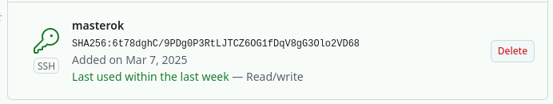
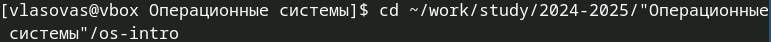
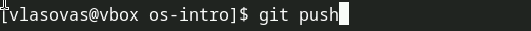

---
## Front matter
lang: ru-RU
title: Лабораторная работа 2
subtitle: Отчет
author:
  - Власов Артем Сергеевич
institute:
  - Российский университет дружбы народов, Москва, Россия
  - Объединённый институт ядерных исследований, Дубна, Россия
date: 1 марта 2025

## i18n babel
babel-lang: russian
babel-otherlangs: english

## Formatting pdf
toc: false
toc-title: Содержание
slide_level: 2
aspectratio: 169
section-titles: true
theme: metropolis
header-includes:
 - \metroset{progressbar=frametitle,sectionpage=progressbar,numbering=fraction}
---

# Информация

## Докладчик

:::::::::::::: {.columns align=center}
::: {.column width="70%"}

  * Власов Артем Сергеевич
  * Группа НПИбд-01-24
  * Студент
  * Российский университет дружбы народов
  * [1132246841@pfur.ru](mailto:1132246841@pfur.ru)

## Цели и задачи

Освоить систему контроля версий и научиться работать с git.

# Задание

Создать базовую конфигурацию для работы с git.

Создать ключ SSH.

Настроить подписи git.

Зарегистрироваться на Github.

Создать локальный каталог для выполнения заданий по предмету.

                                                      

# Выполнение лабораторной работы

## Делаем предварительную конфигурацию git.

:::::::::::::: {.columns align=center}
::: {.column width="70%"}

{#fig:001 width=70%}
:::
::::::::::::::

## Настраиваем utf-8 в выводе сообщения git.

:::::::::::::: {.columns align=center}
::: {.column width="70%"}

{#fig:002 width=70%}

:::
::::::::::::::

## Задаем имя начальной ветки.

:::::::::::::: {.columns align=center}
::: {.column width="70%"}

{#fig:003 width=70%}

{#fig:004 width=70%}

{#fig:005 width=70%}

:::
::::::::::::::

## Создание SSH ключа

:::::::::::::: {.columns align=center}
::: {.column width="70%"}

{#fig:006 width=70%}

{#fig:007 width=70%}
:::
::::::::::::::

## Добавление ключа на github

:::::::::::::: {.columns align=center}
::: {.column width="70%"}

{#fig:008 width=70%}

{#fig:009 width=70%}

:::
::::::::::::::

## Создание локальных каталогов и репозитория по шаблону

:::::::::::::: {.columns align=center}
::: {.column width="70%"}

{#fig:010 width=70%}

{#fig:011 width=70%}

:::
::::::::::::::

## Клонируем репозиторий

:::::::::::::: {.columns align=center}
::: {.column width="70%"}

{#fig:012 width=70%}

{#fig:013 width=70%}

:::
::::::::::::::

## Удаление лишних файлов

:::::::::::::: {.columns align=center}
::: {.column width="70%"}

{#fig:014 width=70%}

{#fig:015 width=70%}

:::
::::::::::::::

## Создание папок по образцу 

:::::::::::::: {.columns align=center}
::: {.column width="70%"}

{#fig:016 width=70%}

:::
::::::::::::::

## Отправка файлов на сервер

:::::::::::::: {.columns align=center}
::: {.column width="70%"}

{#fig:017 width=70%}

{#fig:018 width=70%}

{#fig:019 width=70%}

:::
::::::::::::::

## Выводы
Мы освоили систему контроля версий и получили превичные навыки работы с git. Создали ключи, связали локальные репозитории.
