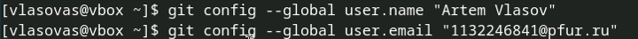
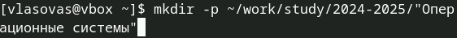
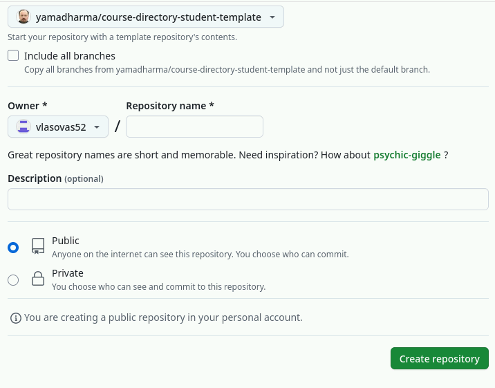
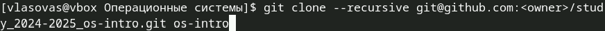
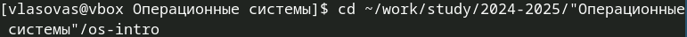
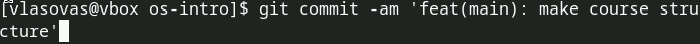

---
## Front matter
title: "Отчет по лабораторной работе 2"
subtitle: "Первоначальная настройка git"
author: "Власов Артем Сергеевич"

## Generic otions
lang: ru-RU
toc-title: "Содержание"
## Bibliography
bibliography: bib/cite.bib
csl: pandoc/csl/gost-r-7-0-5-2008-numeric.csl

## Pdf output format
toc: true # Table of contents
toc-depth: 2
lof: true # List of figures
lot: true # List of tables
fontsize: 12pt
linestretch: 1.5
papersize: a4
documentclass: scrreprt
## I18n polyglossia
polyglossia-lang:
  name: russian
  options:
    - spelling=modern
    - babelshorthands=true
polyglossia-otherlangs:
  name: english
## I18n babel
babel-lang: russian
babel-otherlangs: english
## Fonts
mainfont: IBM Plex Serif
romanfont: IBM Plex Serif
sansfont: IBM Plex Sans
monofont: IBM Plex Mono
mathfont: STIX Two Math
mainfontoptions: Ligatures=Common,Ligatures=TeX,Scale=0.94
romanfontoptions: Ligatures=Common,Ligatures=TeX,Scale=0.94
sansfontoptions: Ligatures=Common,Ligatures=TeX,Scale=MatchLowercase,Scale=0.94
monofontoptions: Scale=MatchLowercase,Scale=0.94,FakeStretch=0.9
mathfontoptions:
## Biblatex
biblatex: true
biblio-style: "gost-numeric"
biblatexoptions:
  - parentracker=true
  - backend=biber
  - hyperref=auto
  - language=auto
  - autolang=other*
  - citestyle=gost-numeric
## Pandoc-crossref LaTeX customization
figureTitle: "Рис."
tableTitle: "Таблица"
listingTitle: "Листинг"
lofTitle: "Список иллюстраций"
lotTitle: "Список таблиц"
lolTitle: "Листинги"
## Misc options
indent: true
header-includes:
  - \usepackage{indentfirst}
  - \usepackage{float} # keep figures where there are in the text
  - \floatplacement{figure}{H} # keep figures where there are in the text
---

# Цель работы

Освоить систему контроля версий и научиться работать с git.

# Задание

Создать базовую конфигурацию для работы с git.

Создать ключ SSH.

Создать ключ PGP.

Настроить подписи git.

Зарегистрироваться на Github.

Создать локальный каталог для выполнения заданий по предмету.

# Выполнение лабораторной работы 2.

Сформируем отчет лабораторной работы номер 2.

Делаем предварительную конфигурацию git. (рис. @fig:001).

{#fig:001 width=70%}

Настраиваем utf-8 в выводе сообщения git. (рис. @fig:002).

{#fig:002 width=70%}

Задаем имя начальной ветки. (рис. @fig:003).

{#fig:003 width=70%}

{#fig:004 width=70%}

{#fig:005 width=70%}

Создаем SSH ключ (рис. @fig:006).

{#fig:006 width=70%}

{#fig:007 width=70%}

Заходим в свой аккаунт на сайте github. Переходим в настройки, SSH ключи. (рис. @fig:008).

{#fig:008 width=70%}

{#fig:009 width=70%}

Открываем терминал и создаем каталоги для предмета "Архитектура компьютера" (рис. @fig:010).

{#fig:010 width=70%}

Переходим на страницу репозитория с шаблоном (рис. @fig:011).

{#fig:011 width=70%}

Переходим в папку с предметом (рис. @fig:012).

{#fig:012 width=70%}

{#fig:013 width=70%}

Переходим в каталог arch-pc (рис. @fig:014).

{#fig:014 width=70%}

{#fig:015 width=70%}

Создаем папки по образцу (рис. @fig:016).

{#fig:016 width=70%}

Отправляем файлы на сервер (рис. @fig:017).

{#fig:017 width=70%}

{#fig:018 width=70%}

{#fig:019 width=70%}

# Ответы на контрольные вопросы

1. **Что такое системы контроля версий (VCS) и для решения каких задач они предназначаются?**

   Системы контроля версий (VCS) — это инструменты для управления изменениями в файлах. Они решают задачи:
   - Хранения истории изменений.
   - Совместной работы над проектами.
   - Ветвления и слияния кода.
   - Отслеживания изменений и их авторов.

2. **Объясните следующие понятия VCS и их отношения: хранилище, commit, история, рабочая копия.**

   - **Хранилище (репозиторий)**: База данных, где хранятся все версии файлов и их история.
   - **Commit**: Фиксация изменений в репозитории. Каждый коммит сохраняет изменения и имеет уникальный идентификатор.
   - **История**: Последовательность коммитов, показывающая, как изменялись файлы.
   - **Рабочая копия**: Текущие файлы, с которыми работает разработчик, извлечённые из репозитория.

3. **Что представляют собой и чем отличаются централизованные и децентрализованные VCS? Приведите примеры VCS каждого вида.**

   - **Централизованные VCS**: Один сервер хранит всю историю. Разработчики работают с локальными копиями, но для фиксации изменений требуется подключение к серверу. Пример: **SVN (Subversion)**.
   - **Децентрализованные VCS**: Каждый разработчик имеет полную копию репозитория, включая всю историю. Примеры: **Git**, **Mercurial**.

4. **Опишите действия с VCS при единоличной работе с хранилищем.**

   - Создать репозиторий: `git init`.
   - Добавить файлы в индекс: `git add <файл>`.
   - Зафиксировать изменения: `git commit -m "Сообщение"`.
   - Просматривать историю: `git log`.

5. **Опишите порядок работы с общим хранилищем VCS.**

   - Клонировать репозиторий: `git clone`.
   - Создать ветку для работы: `git branch <имя_ветки>`.
   - Переключиться на ветку: `git checkout <имя_ветки>`.
   - Зафиксировать изменения: `git commit -m "Сообщение"`.
   - Отправить изменения на сервер: `git push`.
   - Получить изменения с сервера: `git pull`.

6. **Каковы основные задачи, решаемые инструментальным средством Git?**

   - Управление версиями файлов.
   - Ветвление и слияние кода.
   - Совместная работа над проектами.
   - Отслеживание изменений и их авторов.

7. **Назовите и дайте краткую характеристику командам Git.**

   - `git init`: Создать новый репозиторий.
   - `git add`: Добавить файлы в индекс для последующего коммита.
   - `git commit`: Зафиксировать изменения в репозитории.
   - `git push`: Отправить изменения в удалённый репозиторий.
   - `git pull`: Получить изменения из удалённого репозитория.
   - `git branch`: Управление ветками (создание, удаление, просмотр).
   - `git checkout`: Переключение между ветками или коммитами.
   - `git merge`: Слияние веток.
   - `git log`: Просмотр истории коммитов.

8. **Приведите примеры использования при работе с локальным и удалённым репозиториями.**

   - Локальный репозиторий:
     ```bash
     git init
     git add .
     git commit -m "Initial commit"
     ```
   - Удалённый репозиторий:
     ```bash
     git clone <URL>
     git push origin main
     git pull origin main
     ```

9. **Что такое и зачем могут быть нужны ветви (branches)?**

   Ветви (branches) — это отдельные линии разработки в репозитории. Они нужны для:
   - Параллельной работы над разными задачами.
   - Изоляции экспериментальных изменений.
   - Упрощения слияния изменений после завершения работы.

10. **Как и зачем можно игнорировать некоторые файлы при commit?**

    Для игнорирования файлов используется файл `.gitignore`. В него добавляются шаблоны файлов или папок, которые не должны отслеживаться Git. Это полезно для исключения временных файлов, бинарных данных или конфиденциальной информации.

11. **Что такое и зачем могут быть нужны ветви (branches)?**

    (Повтор вопроса 9 для полноты.)
    Ветви (branches) — это отдельные линии разработки в репозитории. Они нужны для:
    - Параллельной работы над разными задачами.
    - Изоляции экспериментальных изменений.
    - Упрощения слияния изменений после завершения работы.


# Выводы

Мы освоили систему контроля версий и получили превичные навыки работы с git. Создали ключи, связали локальные репозитории.

# Список литературы{.unnumbered}

::: {#refs}
:::
