---
## Front matter
lang: ru-RU
title: Лабораторная работа 4
subtitle: Отчет
author:
  - Власов Артем Сергеевич
institute:
  - Российский университет дружбы народов, Москва, Россия
  - Объединённый институт ядерных исследований, Дубна, Россия
date: 4 марта 2025

## i18n babel
babel-lang: russian
babel-otherlangs: english

## Formatting pdf
toc: false
toc-title: Содержание
slide_level: 2
aspectratio: 169
section-titles: true
theme: metropolis
header-includes:
 - \metroset{progressbar=frametitle,sectionpage=progressbar,numbering=fraction}
---

# Информация

## Докладчик

:::::::::::::: {.columns align=center}
::: {.column width="70%"}

  * Власов Артем Сергеевич
  * Группа НПИбд-01-24
  * Студент
  * Российский университет дружбы народов
  * [1132246841@pfur.ru](mailto:1132246841@pfur.ru)

## Цели и задачи

Получение навыков правильной работы с репозиториями git.

# Задание

Выполнить работу для тестового репозитория.

Преобразовать рабочий репозиторий в репозиторий с git-flow и conventional commits.

                                                    
# Выполнение лабораторной работы 4.

## Устанавливаем gitflow.

:::::::::::::: {.columns align=center}
::: {.column width="70%"}

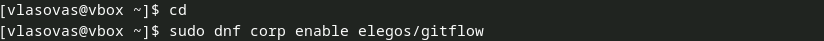{#fig:001 width=70%}

{#fig:002 width=70%}

:::
::::::::::::::

## Устанавливаем nodejs. 

:::::::::::::: {.columns align=center}
::: {.column width="70%"}

{#fig:003 width=70%}

{#fig:004 width=70%}

:::
::::::::::::::

## Настройка nodejs.

:::::::::::::: {.columns align=center}
::: {.column width="70%"}

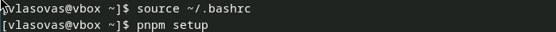{#fig:005 width=70%}

{#fig:006 width=70%}

{#fig:007 width=70%}
:::
::::::::::::::

## Создание и первый коммит в репозиторий git

:::::::::::::: {.columns align=center}
::: {.column width="70%"}

{#fig:008 width=70%}

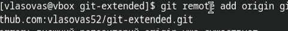{#fig:009 width=70%}

:::
::::::::::::::

## Конфигурация общепринятных коммитов.

:::::::::::::: {.columns align=center}
::: {.column width="70%"}

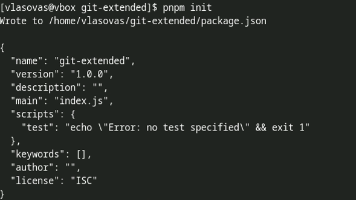{#fig:011 width=70%}

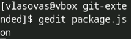{#fig:012 width=70%}

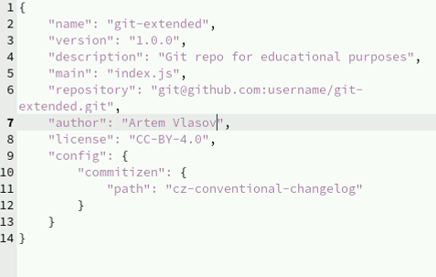{#fig:013 width=70%}

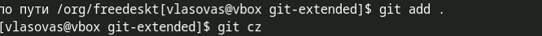{#fig:014 width=70%}

:::
::::::::::::::

## Конфигурация gitflow

:::::::::::::: {.columns align=center}
::: {.column width="70%"}

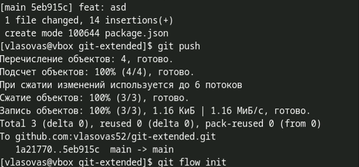{#fig:015 width=70%}

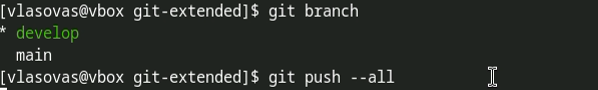{#fig:016 width=70%}

:::
::::::::::::::

## Создание релиза 1.0.0 

:::::::::::::: {.columns align=center}
::: {.column width="70%"}

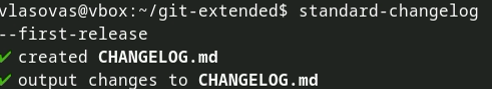{#fig:017 width=70%}

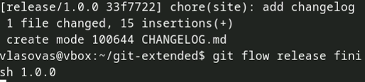{#fig:018 width=70%}

{#fig:019 width=70%}

:::
::::::::::::::

## Создание релиза 1.2.3

:::::::::::::: {.columns align=center}
::: {.column width="70%"}

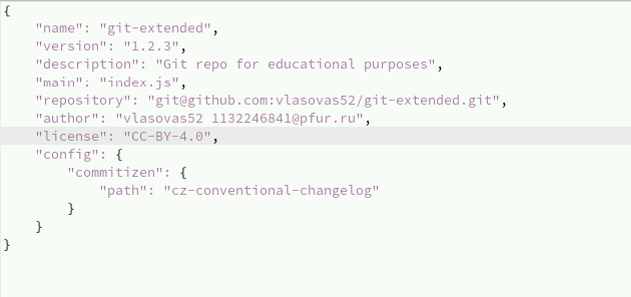{#fig:020 width=70%}

{#fig:021 width=70%}

:::
::::::::::::::

## Создание релиза 1.2.3

:::::::::::::: {.columns align=center}
::: {.column width="70%"}

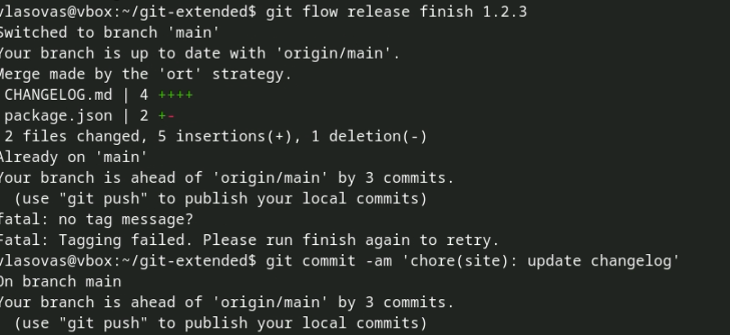{#fig:022 width=70%}

{#fig:023 width=70%}

{#fig:024 width=70%}

:::
::::::::::::::

## Проверка

:::::::::::::: {.columns align=center}
::: {.column width="70%"}

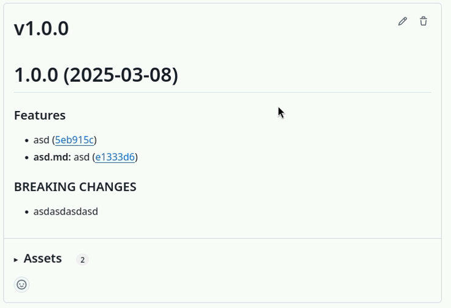{#fig:025 width=70%}

:::
::::::::::::::

## Проверка

:::::::::::::: {.columns align=center}
::: {.column width="70%"}

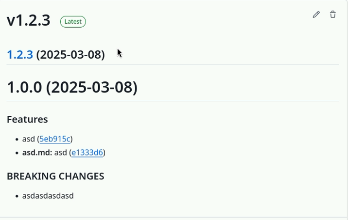{#fig:026 width=70%}

:::
::::::::::::::

## Выводы
Мы научились работать с gitflow, пакетами, конфигами и логами. Преобразовали тестовый репозиторий в репозиторий с gitflow. Научились работать с релизами.
