---
## Front matter
lang: ru-RU
title: Лабораторная работа 5
subtitle: Отчет
author:
  - Власов Артем Сергеевич
institute:
  - Российский университет дружбы народов, Москва, Россия
  - Объединённый институт ядерных исследований, Дубна, Россия
date: 14 марта 2025

## i18n babel
babel-lang: russian
babel-otherlangs: english

## Formatting pdf
toc: false
toc-title: Содержание
slide_level: 2
aspectratio: 169
section-titles: true
theme: metropolis
header-includes:
 - \metroset{progressbar=frametitle,sectionpage=progressbar,numbering=fraction}
---

# Информация

## Докладчик

:::::::::::::: {.columns align=center}
::: {.column width="70%"}

  * Власов Артем Сергеевич
  * Группа НПИбд-01-24
  * Студент
  * Российский университет дружбы народов
  * [1132246841@pfur.ru](mailto:1132246841@pfur.ru)

## Цели и задачи

Получение навыков правильной работы с pass и chezmoi.

# Задание

ВВыполнить первичную установку и настройку pass и chezmoi. Проверить их работу на заднном сценарии.

                                                    
# Выполнение лабораторной работы 5.

## Устанавливаем pass и gopass

:::::::::::::: {.columns align=center}
::: {.column width="70%"}

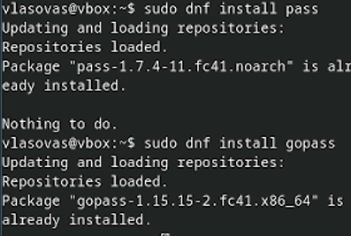{#fig:001 width=70%}

:::
::::::::::::::

## Проверяем наличие ключа gpg

:::::::::::::: {.columns align=center}
::: {.column width="70%"}

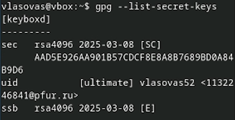{#fig:002 width=70%}

:::
::::::::::::::

## Инициализируем хранилище

:::::::::::::: {.columns align=center}
::: {.column width="70%"}

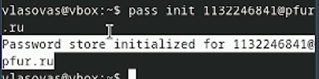{#fig:003 width=70%}

:::
::::::::::::::

## Синхронизация с git

:::::::::::::: {.columns align=center}
::: {.column width="70%"}

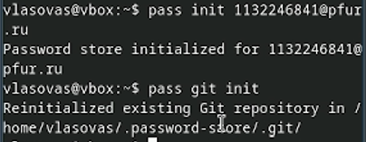{#fig:004 width=70%}

:::
::::::::::::::

## Создание и установка адреса репозитория

:::::::::::::: {.columns align=center}
::: {.column width="70%"}

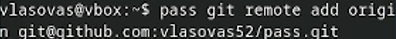{#fig:005 width=70%}

:::
::::::::::::::

## Коммит изменений, сделанных в ручную

:::::::::::::: {.columns align=center}
::: {.column width="70%"}

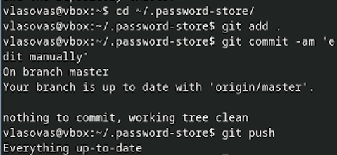{#fig:006 width=70%}

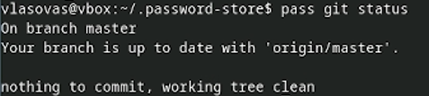{#fig:007 width=70%}

:::
::::::::::::::

## Установка плагина и интерфеса для взаимодействия browserpass

:::::::::::::: {.columns align=center}
::: {.column width="70%"}

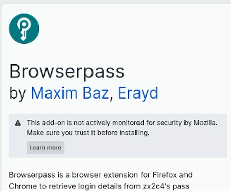{#fig:008 width=70%}

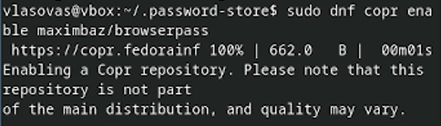{#fig:009 width=70%}

{#fig:010 width=70%}

:::
::::::::::::::

## Сохранение пароля для файла.

:::::::::::::: {.columns align=center}
::: {.column width="70%"}

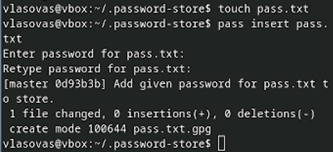{#fig:011 width=70%}

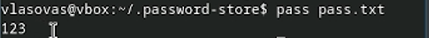{#fig:012 width=70%}

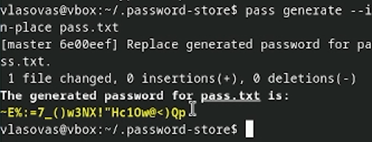{#fig:013 width=70%}
:::
::::::::::::::

## Установка дополнительного программного обеспечения для управления файлами конфигурации.

:::::::::::::: {.columns align=center}
::: {.column width="70%"}

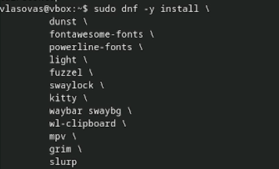{#fig:014 width=70%}

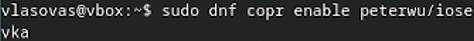{#fig:015 width=70%}

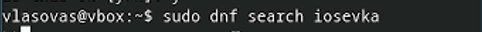{#fig:016 width=70%}

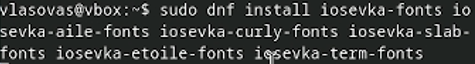{#fig:017 width=70%}

:::
::::::::::::::

## Установка бинарного файла chezmoi

:::::::::::::: {.columns align=center}
::: {.column width="70%"}

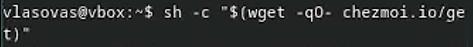{#fig:018 width=70%}

:::
::::::::::::::

## Создание и подключение репозитория 

:::::::::::::: {.columns align=center}
::: {.column width="70%"}

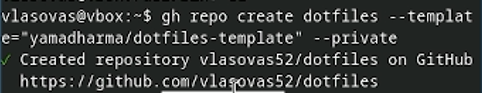{#fig:019 width=70%}

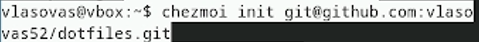{#fig:020 width=70%}

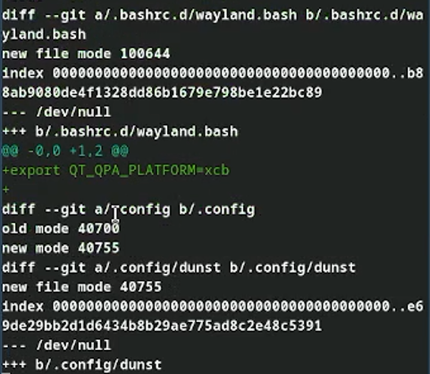{#fig:021 width=70%}

:::
::::::::::::::

## Ежедневные операции с chezmoiя

:::::::::::::: {.columns align=center}
::: {.column width="70%"}

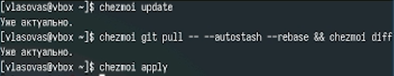{#fig:022 width=70%}

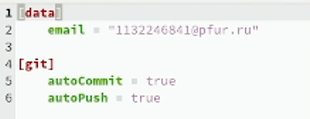{#fig:023 width=70%}

:::
::::::::::::::

## Выводы
Мы получили практические навыки работы с pass и chezmoi. Проверили их работу на определенном сценарии на двух созданных репозиториях. Связали устройство и удаленный репозиторий на github c помощью pass и chezmoi.
