---
## Front matter
lang: ru-RU
title: Лабораторная работа 6
subtitle: Отчет
author:
  - Власов Артем Сергеевич
institute:
  - Российский университет дружбы народов, Москва, Россия
  - Объединённый институт ядерных исследований, Дубна, Россия
date: 22 марта 2025

## i18n babel
babel-lang: russian
babel-otherlangs: english

## Formatting pdf
toc: false
toc-title: Содержание
slide_level: 2
aspectratio: 169
section-titles: true
theme: metropolis
header-includes:
 - \metroset{progressbar=frametitle,sectionpage=progressbar,numbering=fraction}
---

# Информация

## Докладчик

:::::::::::::: {.columns align=center}
::: {.column width="70%"}

  * Власов Артем Сергеевич
  * Группа НПИбд-01-24
  * Студент
  * Российский университет дружбы народов
  * [1132246841@pfur.ru](mailto:1132246841@pfur.ru)

## Цели и задачи

Приобретение практических навыков взаимодействия пользователя с системой посредством командной строки.

# Задание

Выполнить последовательность комманд по заданному сценарию для ознакомления с элементами командой строки.

                                                    
# Выполнение лабораторной работы 6.

## Открываем коммандную строку и выводим на экран путь к домашнему каталогу

:::::::::::::: {.columns align=center}
::: {.column width="70%"}

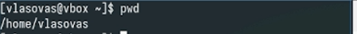{#fig:001 width=70%}

:::
::::::::::::::

## Переходим в папку temp

:::::::::::::: {.columns align=center}
::: {.column width="70%"}

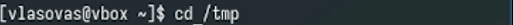{#fig:002 width=70%}

:::
::::::::::::::

## Реализуем просмотр содержимого папки с помощью комманды ls и дополнительных аргументов

:::::::::::::: {.columns align=center}
::: {.column width="70%"}

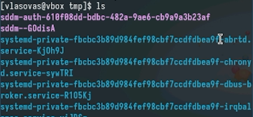{#fig:003 width=70%}

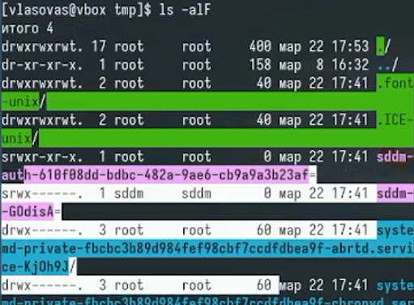{#fig:004 width=70%}

:::
::::::::::::::

## Переходим в каталог /var/spool и проверяем наличие папки cron.

:::::::::::::: {.columns align=center}
::: {.column width="70%"}

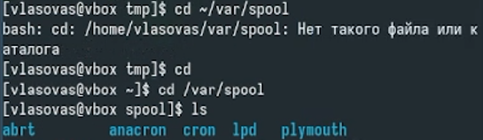{#fig:005 width=70%}

:::
::::::::::::::

## Переходим в домашний каталог и смотрим расширенную информацию о всех файлах и подкаталогах

:::::::::::::: {.columns align=center}
::: {.column width="70%"}

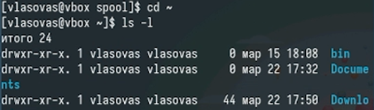{#fig:006 width=70%}

:::
::::::::::::::

## Создание каталогов с помощью mkdir

:::::::::::::: {.columns align=center}
::: {.column width="70%"}

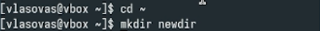{#fig:007 width=70%}

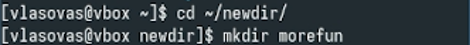{#fig:008 width=70%}

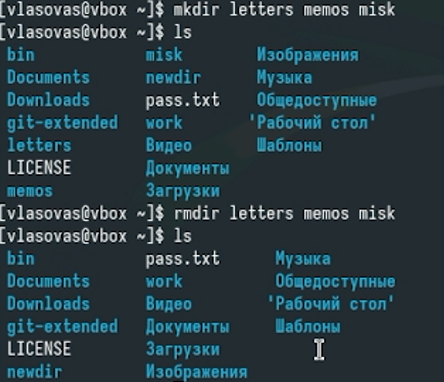{#fig:009 width=70%}

:::
::::::::::::::

## Использование rm и rmdir.

:::::::::::::: {.columns align=center}
::: {.column width="70%"}

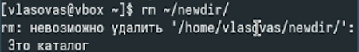{#fig:010 width=70%}

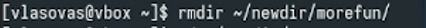{#fig:011 width=70%}

:::
::::::::::::::

## Рекурсивный вывод всех подкаталогов

:::::::::::::: {.columns align=center}
::: {.column width="70%"}

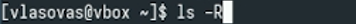{#fig:012 width=70%}

:::
::::::::::::::

## Вывод содержимог, отсортированного по времени с подробной информацией

:::::::::::::: {.columns align=center}
::: {.column width="70%"}

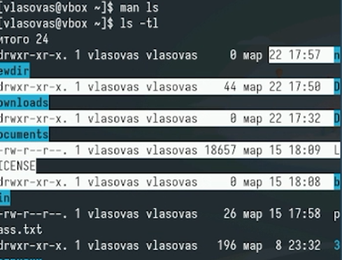{#fig:013 width=70%}

:::
::::::::::::::

## Информация о cd

:::::::::::::: {.columns align=center}
::: {.column width="70%"}

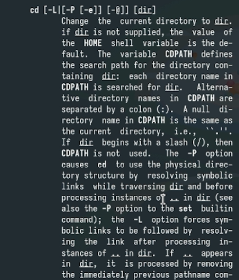{#fig:014 width=70%}

:::
::::::::::::::

## Информация о pwd

:::::::::::::: {.columns align=center}
::: {.column width="70%"}

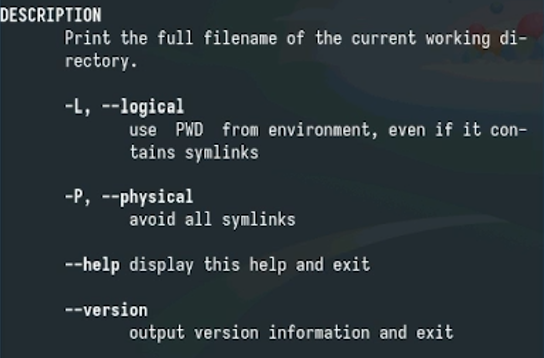{#fig:015 width=70%}

:::
::::::::::::::

## Информация о mkdir

:::::::::::::: {.columns align=center}
::: {.column width="70%"}

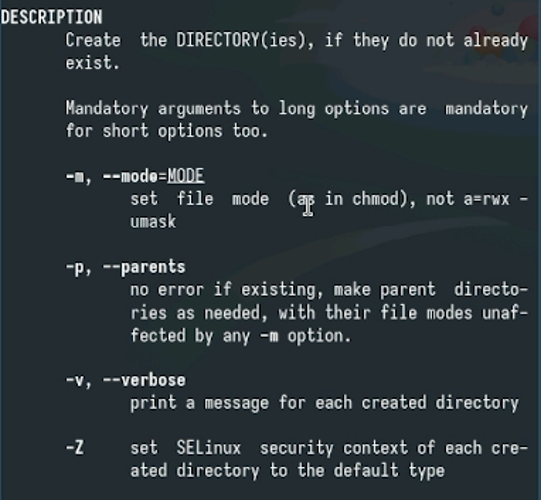{#fig:016 width=70%}

:::
::::::::::::::

## Информация о rmdir

:::::::::::::: {.columns align=center}
::: {.column width="70%"}

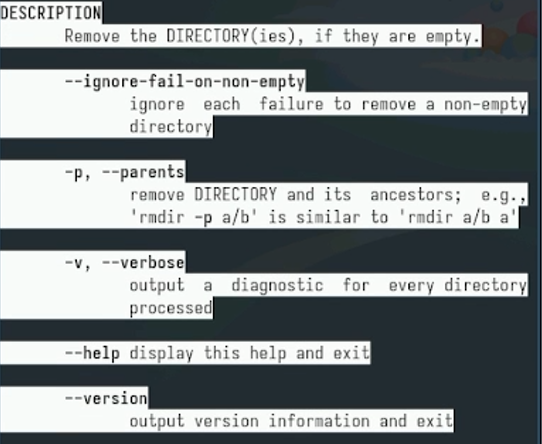{#fig:017 width=70%}

:::
::::::::::::::

## Информация о rm

:::::::::::::: {.columns align=center}
::: {.column width="70%"}

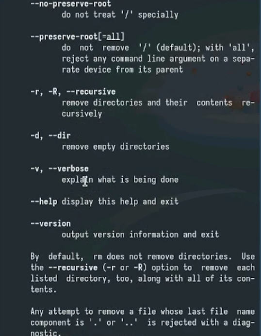{#fig:018 width=70%}

:::
::::::::::::::

## История вводы командной строки

:::::::::::::: {.columns align=center}
::: {.column width="70%"}

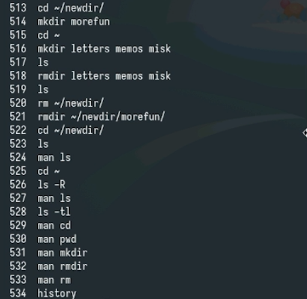{#fig:019 width=70%}

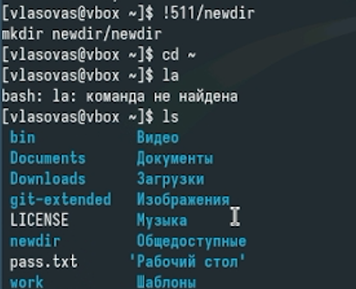{#fig:020 width=70%}

:::
::::::::::::::

## Выводы
Мы получили практические навыки работы c коммандной строкой. Научились пользоваться различными инструментами для создания, удаления и просмотра каталогов, ознакомились с параметрами комманд.
