---
## Front matter
lang: ru-RU
title: Лабораторная работа 7
subtitle: Отчет
author:
  - Власов Артем Сергеевич
institute:
  - Российский университет дружбы народов, Москва, Россия
  - Объединённый институт ядерных исследований, Дубна, Россия
date: 29 марта 2025

## i18n babel
babel-lang: russian
babel-otherlangs: english

## Formatting pdf
toc: false
toc-title: Содержание
slide_level: 2
aspectratio: 169
section-titles: true
theme: metropolis
header-includes:
 - \metroset{progressbar=frametitle,sectionpage=progressbar,numbering=fraction}
---

# Информация

## Докладчик

:::::::::::::: {.columns align=center}
::: {.column width="70%"}

  * Власов Артем Сергеевич
  * Группа НПИбд-01-24
  * Студент
  * Российский университет дружбы народов
  * [1132246841@pfur.ru](mailto:1132246841@pfur.ru)

## Цели и задачи

Ознакомление с файловой системой Linux, её структурой, именами и содержанием каталогов. Приобретение практических навыков по применению команд для работы с файлами и каталогами, по управлению процессами (и работами), по проверке использования диска и обслуживанию файловой системы.

# Задание

Выполнить последовательность комманд для работы с файловой системой по заданному сценарию.
                                                    
# Выполнение лабораторной работы 7.

## Просмотр содержимого файла

:::::::::::::: {.columns align=center}
::: {.column width="70%"}

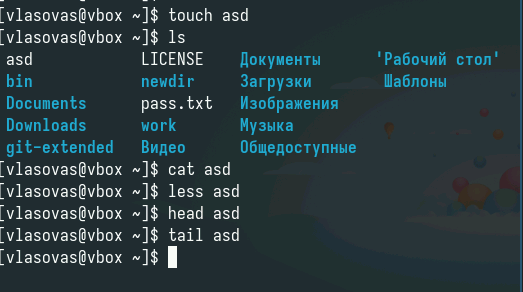{#fig:001 width=70%}

:::
::::::::::::::

## Создание файла и его копий с другим именем

:::::::::::::: {.columns align=center}
::: {.column width="70%"}

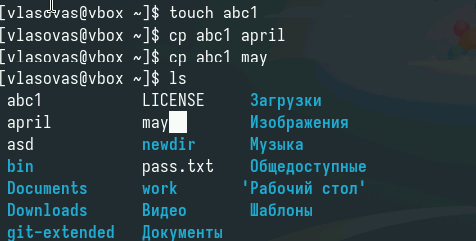{#fig:002 width=70%}

:::
::::::::::::::

## Перемещение файлов в новый каталог

:::::::::::::: {.columns align=center}
::: {.column width="70%"}

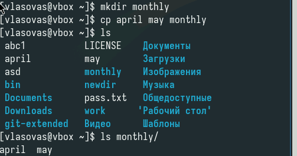{#fig:003 width=70%}

:::
::::::::::::::

## Создание копии файла внутри каталога

:::::::::::::: {.columns align=center}
::: {.column width="70%"}

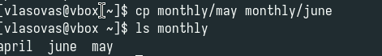{#fig:004 width=70%}

:::
::::::::::::::

## Создаем новый каталог и копируем в него весь другой каталог

:::::::::::::: {.columns align=center}
::: {.column width="70%"}

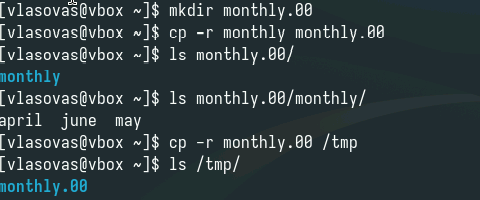{#fig:005 width=70%}

:::
::::::::::::::

## Переименование файла.

:::::::::::::: {.columns align=center}
::: {.column width="70%"}

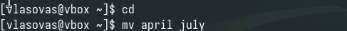{#fig:006 width=70%}

:::
::::::::::::::

## Перемещение файла в каталог

:::::::::::::: {.columns align=center}
::: {.column width="70%"}

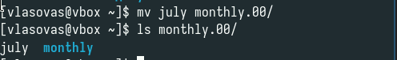{#fig:007 width=70%}

:::
::::::::::::::

## Перемещение каталога внутрь другого каталога

:::::::::::::: {.columns align=center}
::: {.column width="70%"}

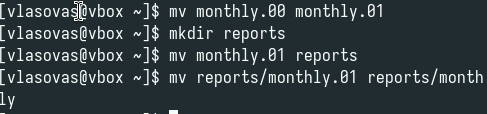{#fig:008 width=70%}	

:::
::::::::::::::

## Просмотр и изменение прав доступа для нового файла и каталога

:::::::::::::: {.columns align=center}
::: {.column width="70%"}

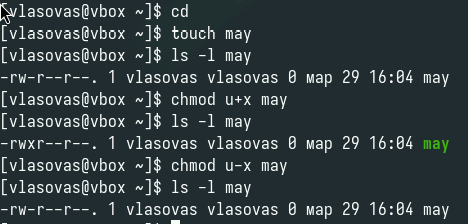{#fig:009 width=70%}

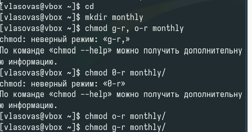{#fig:010 width=70%}

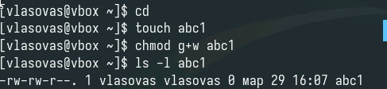{#fig:011 width=70%}

:::
::::::::::::::

## Изменение права на чтение и попытка открыть или скопировать файл

:::::::::::::: {.columns align=center}
::: {.column width="70%"}

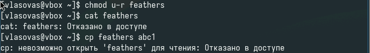{#fig:023 width=70%}

:::
::::::::::::::

## Изменение права на выполнение и поппытка перейти в каталог

:::::::::::::: {.columns align=center}
::: {.column width="70%"}

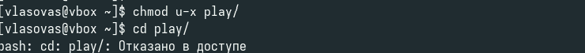{#fig:023 width=70%}

:::
::::::::::::::

## Выводы
Мы ознакомились с файловой системой Linux, её структурой, именами и содержанием каталогов. приобрели практические навыки по применению команд для работы с файлами и каталогами, по управлению процессами (и работами), по проверке использования диска и обслуживанию файловой системы.
