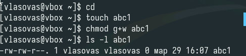

---
## Front matter
title: "Отчет по лабораторной работе 7"
subtitle: "Анализ файловой системы Linux. Команды для работы с файлами и каталогами"
author: "Власов Артем Сергеевич"

## Generic otions
lang: ru-RU
toc-title: "Содержание"
## Bibliography
bibliography: bib/cite.bib
csl: pandoc/csl/gost-r-7-0-5-2008-numeric.csl

## Pdf output format
toc: true # Table of contents
toc-depth: 2
lof: true # List of figures
lot: true # List of tables
fontsize: 12pt
linestretch: 1.5
papersize: a4
documentclass: scrreprt
## I18n polyglossia
polyglossia-lang:
  name: russian
  options:
    - spelling=modern
    - babelshorthands=true
polyglossia-otherlangs:
  name: english
## I18n babel
babel-lang: russian
babel-otherlangs: english
## Fonts
mainfont: IBM Plex Serif
romanfont: IBM Plex Serif
sansfont: IBM Plex Sans
monofont: IBM Plex Mono
mathfont: STIX Two Math
mainfontoptions: Ligatures=Common,Ligatures=TeX,Scale=0.94
romanfontoptions: Ligatures=Common,Ligatures=TeX,Scale=0.94
sansfontoptions: Ligatures=Common,Ligatures=TeX,Scale=MatchLowercase,Scale=0.94
monofontoptions: Scale=MatchLowercase,Scale=0.94,FakeStretch=0.9
mathfontoptions:
## Biblatex
biblatex: true
biblio-style: "gost-numeric"
biblatexoptions:
  - parentracker=true
  - backend=biber
  - hyperref=auto
  - language=auto
  - autolang=other*
  - citestyle=gost-numeric
## Pandoc-crossref LaTeX customization
figureTitle: "Рис."
tableTitle: "Таблица"
listingTitle: "Листинг"
lofTitle: "Список иллюстраций"
lotTitle: "Список таблиц"
lolTitle: "Листинги"
## Misc options
indent: true
header-includes:
  - \usepackage{indentfirst}
  - \usepackage{float} # keep figures where there are in the text
  - \floatplacement{figure}{H} # keep figures where there are in the text
---

# Цель работы

Ознакомление с файловой системой Linux, её структурой, именами и содержанием каталогов. Приобретение практических навыков по применению команд для работы с файлами и каталогами, по управлению процессами (и работами), по проверке использования диска и обслуживанию файловой системы.

# Задание

Выполнить последовательность комманд для работы с файловой системой по заданному сценарию.

# Выполнение лабораторной работы 7.

Просмотр содержимого файла. (рис. @fig:001).

{#fig:001 width=70%}

Создание файла и его копий с другим именем. (рис. @fig:002).

{#fig:002 width=70%}

Перемещение файлов в новый каталог. (рис. @fig:003).

{#fig:003 width=70%}

Создание копии файла внутри каталога. (рис. @fig:004).

{#fig:004 width=70%}

Создаем новый каталог и копируем в него весь другой каталог. (рис. @fig:005).

{#fig:005 width=70%}

Переименование файла. (рис. @fig:006).

{#fig:006 width=70%}

Перемещение файла в каталог(рис. @fig:007).

{#fig:007 width=70%}

Перемещение каталога внутрь другого каталога(рис. @fig:008).

{#fig:008 width=70%}	

Просмотр и изменение прав доступа для нового файла(рис. @fig:009).

{#fig:009 width=70%}

Просмотр и изменение прав доступа для каталога(рис. @fig:010).

{#fig:010 width=70%}

Изменение права на изменение файла для отдельной группы. (рис. @fig:011).

{#fig:011 width=70%}

Копирование файла в домашний каталог. (рис. @fig:012).

{#fig:012 width=70%}

Создание нового каталога. (рис. @fig:013)

{#fig:013 width=70%}

Перемещение файла в каталог. (рис. @fig:014).

{#fig:014 width=70%}

Переименование файла. (рис. @fig:015).

{#fig:015 width=70%}

Копирование файла внутрь каталога. (рис. @fig:016).

{#fig:016 width=70%}

Создание подкаталога. (рис. @fig:017).

{#fig:017 width=70%}

Перемещение нескольких файлов в каталог одной командой. (рис. @fig:018).

{#fig:018 width=70%}

Создание нового каталога и перемещение его внутрь другого(рис. @fig:019).

{#fig:019 width=70%}

Изменение прав доступа файлов(рис. @fig:020).

{#fig:020 width=70%}

Копирование файла(рис. @fig:021).

{#fig:021 width=70%}

Перемещение файла в новый каталог(рис. @fig:022).

{#fig:022 width=70%}

Проверка(рис. @fig:023).

{#fig:023 width=70%}

Копирование каталога в подкаталог(рис. @fig:024).

{#fig:024 width=70%}

Перемещение файлов внутри каталога(рис. @fig:025).

{#fig:025 width=70%}

Изменение права на чтение и попытка открыть или скопировать файл(рис. @fig:026).

{#fig:026 width=70%}

Изменение права на выполнение и поппытка перейти в каталог(рис. @fig:027).

{#fig:027 width=70%}

# Выводы

Мы ознакомились с файловой системой Linux, её структурой, именами и содержанием каталогов. приобрели практические навыки по применению команд для работы с файлами и каталогами, по управлению процессами (и работами), по проверке использования диска и обслуживанию файловой системы.

# Список литературы{.unnumbered}

::: {#refs}
:::
