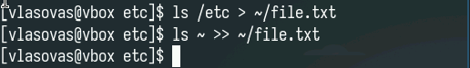
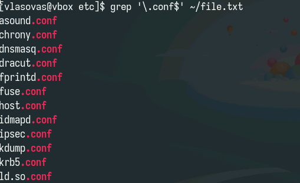
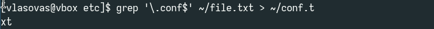
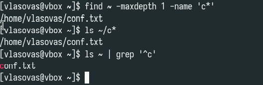
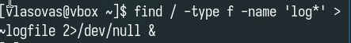
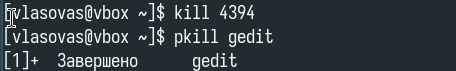
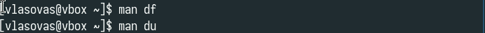
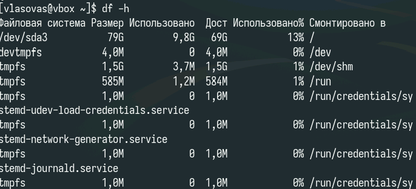

---
## Front matter
lang: ru-RU
title: Лабораторная работа 8
subtitle: Отчет
author:
  - Власов Артем Сергеевич
institute:
  - Российский университет дружбы народов, Москва, Россия
  - Объединённый институт ядерных исследований, Дубна, Россия
date: 4 апреля 2025

## i18n babel
babel-lang: russian
babel-otherlangs: english

## Formatting pdf
toc: false
toc-title: Содержание
slide_level: 2
aspectratio: 169
section-titles: true
theme: metropolis
header-includes:
 - \metroset{progressbar=frametitle,sectionpage=progressbar,numbering=fraction}
---

# Информация

## Докладчик

:::::::::::::: {.columns align=center}
::: {.column width="70%"}

  * Власов Артем Сергеевич
  * Группа НПИбд-01-24
  * Студент
  * Российский университет дружбы народов
  * [1132246841@pfur.ru](mailto:1132246841@pfur.ru)

## Цели и задачи

Ознакомление с инструментами поиска файлов и фильтрации текстовых данных.
Приобретение практических навыков: по управлению процессами (и заданиями), по проверке использования диска и обслуживанию файловых систем.

# Задание

Выполнить последовательность комманд для работы с файловой системой по заданному сценарию.
                                                    
# Выполнение лабораторной работы 8.

## Запись названий файлов из двух каталогов.

:::::::::::::: {.columns align=center}
::: {.column width="70%"}

{#fig:001 width=70%}

:::
::::::::::::::

## Вывод файлов с заданным расширением.

:::::::::::::: {.columns align=center}
::: {.column width="70%"}

{#fig:002 width=70%}

:::
::::::::::::::

## Запись названий фалйов .conf в отдельный файл.

:::::::::::::: {.columns align=center}
::: {.column width="70%"}

{#fig:003 width=70%}

:::
::::::::::::::

## Поиск файлов с заданной первой буквой названия.

:::::::::::::: {.columns align=center}
::: {.column width="70%"}

{#fig:004 width=70%}

:::
::::::::::::::

## ВЫвод файлов с заданной первой буквой названия по странично.

:::::::::::::: {.columns align=center}
::: {.column width="70%"}

{#fig:005 width=70%}

:::
::::::::::::::

## Фоновая запись файлов начинающихся с log в отдельный файл.

:::::::::::::: {.columns align=center}
::: {.column width="70%"}

{#fig:006 width=70%}

:::
::::::::::::::

## Удаление файла

:::::::::::::: {.columns align=center}
::: {.column width="70%"}

{#fig:007 width=70%}

:::
::::::::::::::

## Завершение процесса командой kill

:::::::::::::: {.columns align=center}
::: {.column width="70%"}

{#fig:008 width=70%}

:::
::::::::::::::

## Справка по командам df и du

:::::::::::::: {.columns align=center}
::: {.column width="70%"}

{#fig:009 width=70%}

:::
::::::::::::::

## Использование df

:::::::::::::: {.columns align=center}
::: {.column width="70%"}

{#fig:010 width=70%}

:::
::::::::::::::

## Использование du. 

:::::::::::::: {.columns align=center}
::: {.column width="70%"}

{#fig:011 width=70%}

:::
::::::::::::::

## Поиск по типу элемента(директорий) с разным форматом вывода.

:::::::::::::: {.columns align=center}
::: {.column width="70%"}

{#fig:012 width=70%}

{#fig:013 width=70%}

:::
::::::::::::::

## Выводы
Мы ознакомились с файловой системой Linux, её структурой, именами и содержанием каталогов. Получили навыки рабоыт с системой поиска файлов и системой воновых процессов. Научились применять их на практике.
