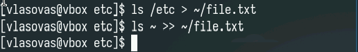
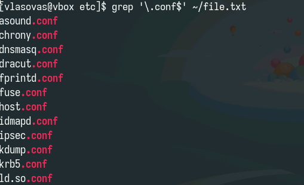
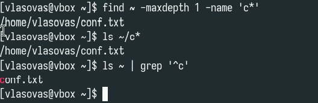
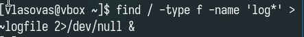
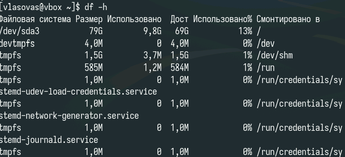

---
## Front matter
title: "Отчет по лабораторной работе 8"
subtitle: "Поиск файлов. Перенаправление ввода-вывода. Просмотр запущенных процессов"
author: "Власов Артем Сергеевич"

## Generic otions
lang: ru-RU
toc-title: "Содержание"
## Bibliography
bibliography: bib/cite.bib
csl: pandoc/csl/gost-r-7-0-5-2008-numeric.csl

## Pdf output format
toc: true # Table of contents
toc-depth: 2
lof: true # List of figures
lot: true # List of tables
fontsize: 12pt
linestretch: 1.5
papersize: a4
documentclass: scrreprt
## I18n polyglossia
polyglossia-lang:
  name: russian
  options:
    - spelling=modern
    - babelshorthands=true
polyglossia-otherlangs:
  name: english
## I18n babel
babel-lang: russian
babel-otherlangs: english
## Fonts
mainfont: IBM Plex Serif
romanfont: IBM Plex Serif
sansfont: IBM Plex Sans
monofont: IBM Plex Mono
mathfont: STIX Two Math
mainfontoptions: Ligatures=Common,Ligatures=TeX,Scale=0.94
romanfontoptions: Ligatures=Common,Ligatures=TeX,Scale=0.94
sansfontoptions: Ligatures=Common,Ligatures=TeX,Scale=MatchLowercase,Scale=0.94
monofontoptions: Scale=MatchLowercase,Scale=0.94,FakeStretch=0.9
mathfontoptions:
## Biblatex
biblatex: true
biblio-style: "gost-numeric"
biblatexoptions:
  - parentracker=true
  - backend=biber
  - hyperref=auto
  - language=auto
  - autolang=other*
  - citestyle=gost-numeric
## Pandoc-crossref LaTeX customization
figureTitle: "Рис."
tableTitle: "Таблица"
listingTitle: "Листинг"
lofTitle: "Список иллюстраций"
lotTitle: "Список таблиц"
lolTitle: "Листинги"
## Misc options
indent: true
header-includes:
  - \usepackage{indentfirst}
  - \usepackage{float} # keep figures where there are in the text
  - \floatplacement{figure}{H} # keep figures where there are in the text
---

# Цель работы

Ознакомление с инструментами поиска файлов и фильтрации текстовых данных.
Приобретение практических навыков: по управлению процессами (и заданиями), по проверке использования диска и обслуживанию файловых систем.

# Задание

Выполнить последовательность комманд для работы с файловой системой по заданному сценарию.

# Выполнение лабораторной работы 8.

Запись названий файлов из двух каталогов. (рис. @fig:001).

{#fig:001 width=70%}

Вывод файлов с заданным расширением. (рис. @fig:002).

{#fig:002 width=70%}

Запись названий фалйов .conf в отдельный файл. (рис. @fig:003).

{#fig:003 width=70%}

Поиск файлов с заданной первой буквой названия. (рис. @fig:004).

{#fig:004 width=70%}

ВЫвод файлов с заданной первой буквой названия по странично. (рис. @fig:005).

{#fig:005 width=70%}

Фоновая запись файлов начинающихся с log в отдельный файл. (рис. @fig:006).

{#fig:006 width=70%}

Удаление файла(рис. @fig:007).

{#fig:007 width=70%}

Завершение процесса командой kill(рис. @fig:008).

{#fig:008 width=70%}	

Справка по командам df и du(рис. @fig:009).

{#fig:009 width=70%}

Использование df(рис. @fig:010).

{#fig:010 width=70%}

Использование du. (рис. @fig:011).

{#fig:011 width=70%}

Поиск по типу элемента(директорий) с разным форматом вывода. (рис. @fig:012).

{#fig:012 width=70%}

{#fig:013 width=70%}

# Выводы

Мы ознакомились с файловой системой Linux, её структурой, именами и содержанием каталогов. Получили навыки рабоыт с системой поиска файлов и системой воновых процессов. Научились применять их на практике.

# Список литературы{.unnumbered}

::: {#refs}
:::
