---
## Front matter
lang: ru-RU
title: Лабораторная работа 9
subtitle: Отчет
author:
  - Власов Артем Сергеевич
institute:
  - Российский университет дружбы народов, Москва, Россия
  - Объединённый институт ядерных исследований, Дубна, Россия
date: 12 апреля 2025

## i18n babel
babel-lang: russian
babel-otherlangs: english

## Formatting pdf
toc: false
toc-title: Содержание
slide_level: 2
aspectratio: 169
section-titles: true
theme: metropolis
header-includes:
 - \metroset{progressbar=frametitle,sectionpage=progressbar,numbering=fraction}
---

# Информация

## Докладчик

:::::::::::::: {.columns align=center}
::: {.column width="70%"}

  * Власов Артем Сергеевич
  * Группа НПИбд-01-24
  * Студент
  * Российский университет дружбы народов
  * [1132246841@pfur.ru](mailto:1132246841@pfur.ru)

## Цели и задачи

Освоение основных возможностей командной оболочки Midnight Commander. Приобретение навыков практической работы по просмотру каталогов и файлов; манипуляций с ними.

# Задание

Выполнить последовательность комманд по заданному сценарию.
                                                    
# Выполнение лабораторной работы 9.

## Просмотр справки Midnight Commander.

:::::::::::::: {.columns align=center}
::: {.column width="70%"}

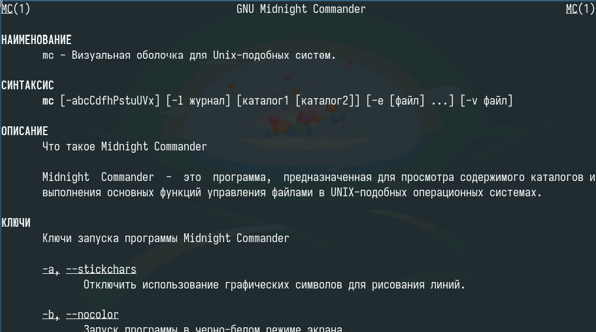{#fig:001 width=70%}

:::
::::::::::::::

## Система Midnight Commander.

:::::::::::::: {.columns align=center}
::: {.column width="70%"}

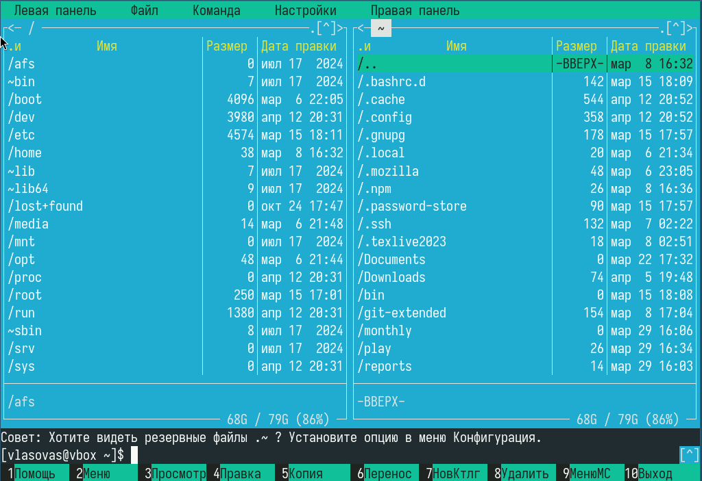{#fig:002 width=70%}

:::
::::::::::::::

## Выделение файлов. 

:::::::::::::: {.columns align=center}
::: {.column width="70%"}

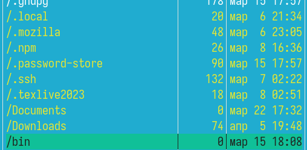{#fig:003 width=70%}

:::
::::::::::::::

## Копирование файлов.

:::::::::::::: {.columns align=center}
::: {.column width="70%"}

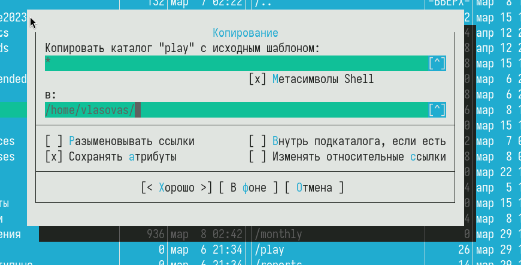{#fig:004 width=70%}

:::
::::::::::::::

## Просмотр информации по файлу.

:::::::::::::: {.columns align=center}
::: {.column width="70%"}

{#fig:005 width=70%}

:::
::::::::::::::

## Просмотр информации по файлу с помощью Midnight Commander.

:::::::::::::: {.columns align=center}
::: {.column width="70%"}

{#fig:006 width=70%}

:::
::::::::::::::

## Редактор Midnight Commander

:::::::::::::: {.columns align=center}
::: {.column width="70%"}

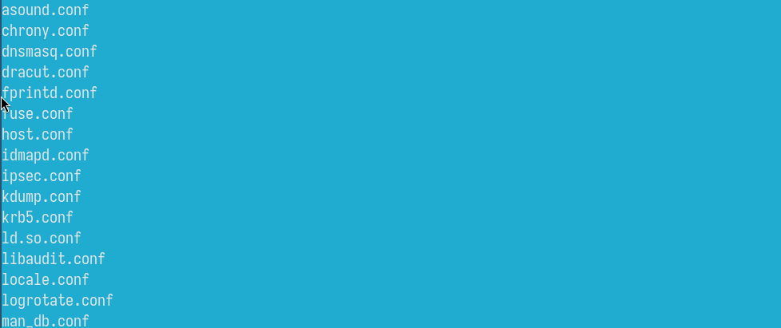{#fig:007 width=70%}

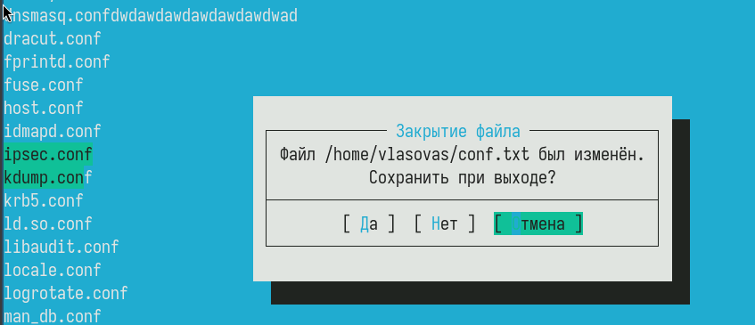{#fig:008 width=70%}	

:::
::::::::::::::

## Создание нового каталога и его копирование

:::::::::::::: {.columns align=center}
::: {.column width="70%"}

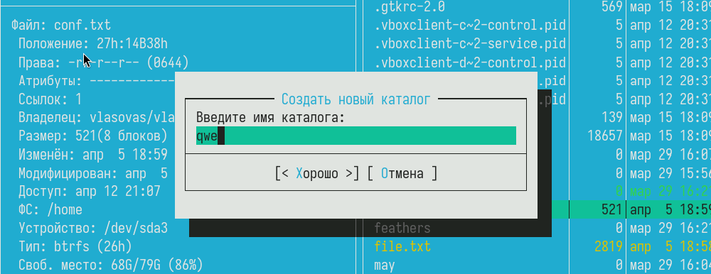{#fig:009 width=70%}

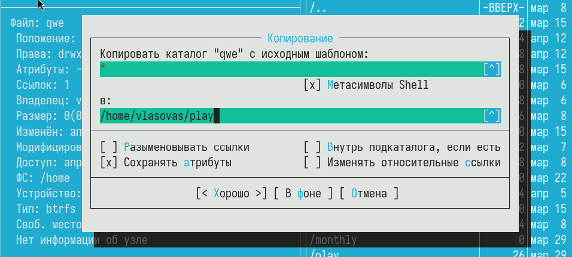{#fig:010 width=70%}

:::
::::::::::::::

## Поиск файла.

:::::::::::::: {.columns align=center}
::: {.column width="70%"}

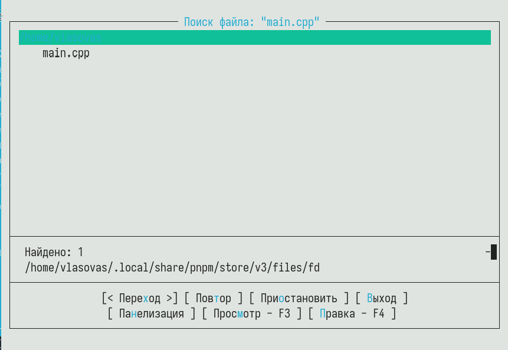{#fig:011 width=70%}

:::
::::::::::::::

## Дерево каталогов и перемещние в домашний каталог.

:::::::::::::: {.columns align=center}
::: {.column width="70%"}

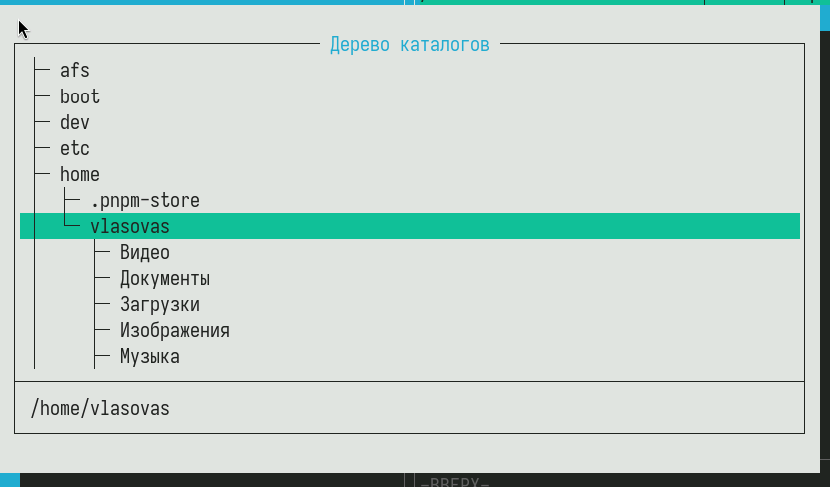{#fig:012 width=70%}

:::
::::::::::::::

## Файл меню и расширений

:::::::::::::: {.columns align=center}
::: {.column width="70%"}

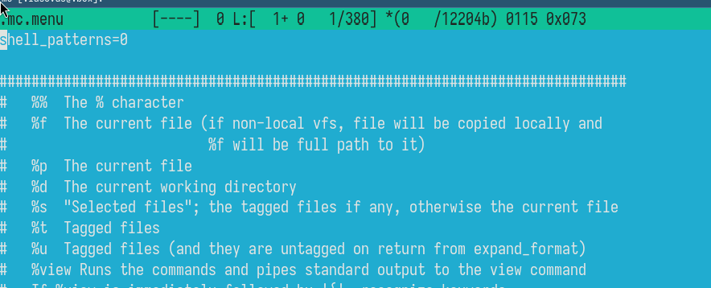{#fig:013 width=70%}

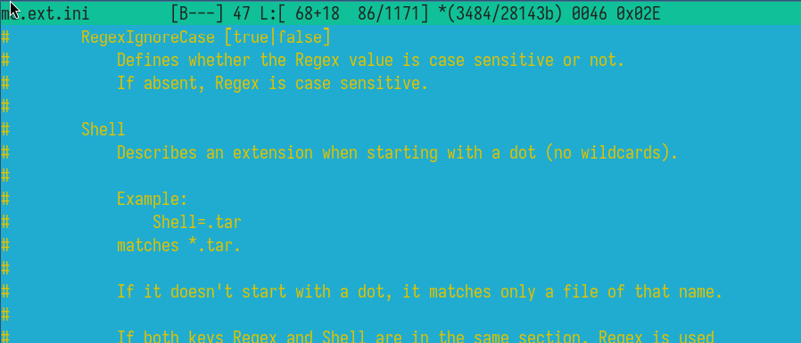{#fig:014 width=70%}

:::
::::::::::::::

## Настройки mc(внешний вид).

:::::::::::::: {.columns align=center}
::: {.column width="70%"}

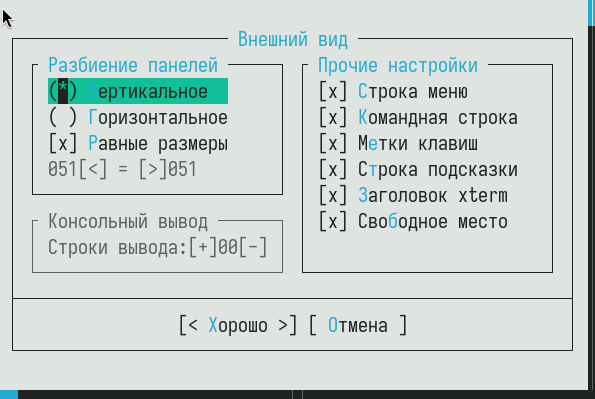{#fig:015 width=70%}

:::
::::::::::::::

## Удаление строки.

:::::::::::::: {.columns align=center}
::: {.column width="70%"}

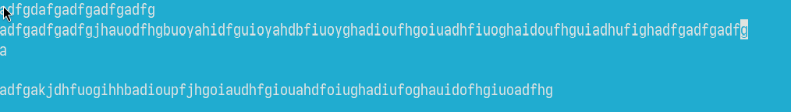{#fig:017 width=70%}

{#fig:018 width=70%}

:::
::::::::::::::

## Копирование строк

:::::::::::::: {.columns align=center}
::: {.column width="70%"}

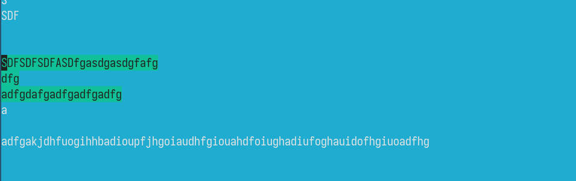{#fig:019 width=70%}

{#fig:020 width=70%}

:::
::::::::::::::

## Перемещение строк

:::::::::::::: {.columns align=center}
::: {.column width="70%"}

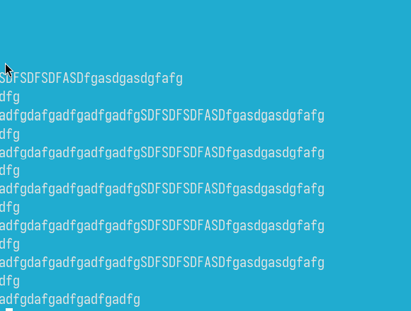{#fig:021 width=70%}

:::
::::::::::::::

## Отключение подстветки синтаксиса

:::::::::::::: {.columns align=center}
::: {.column width="70%"}

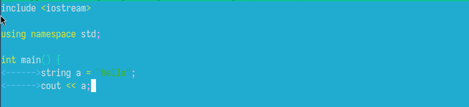{#fig:023 width=70%}

{#fig:024 width=70%}

:::
::::::::::::::

## Выводы
Мы освоили основные возможности командной оболочки Midnight Commander. Приобрели навыки практической работы по просмотру каталогов и файлов; манипуляций с ними.
