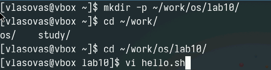
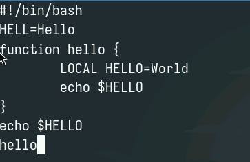
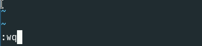
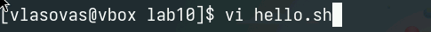
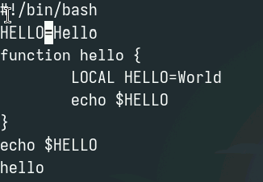
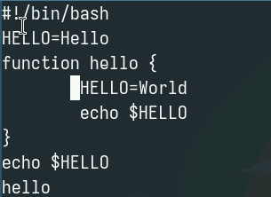
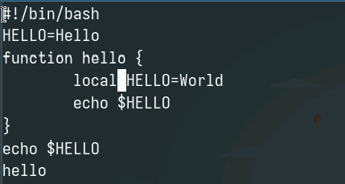
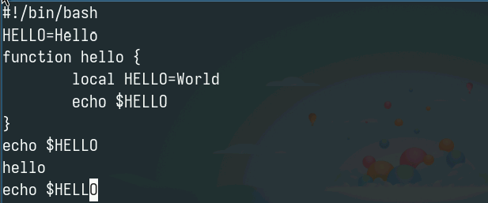
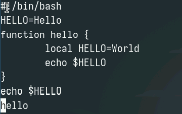
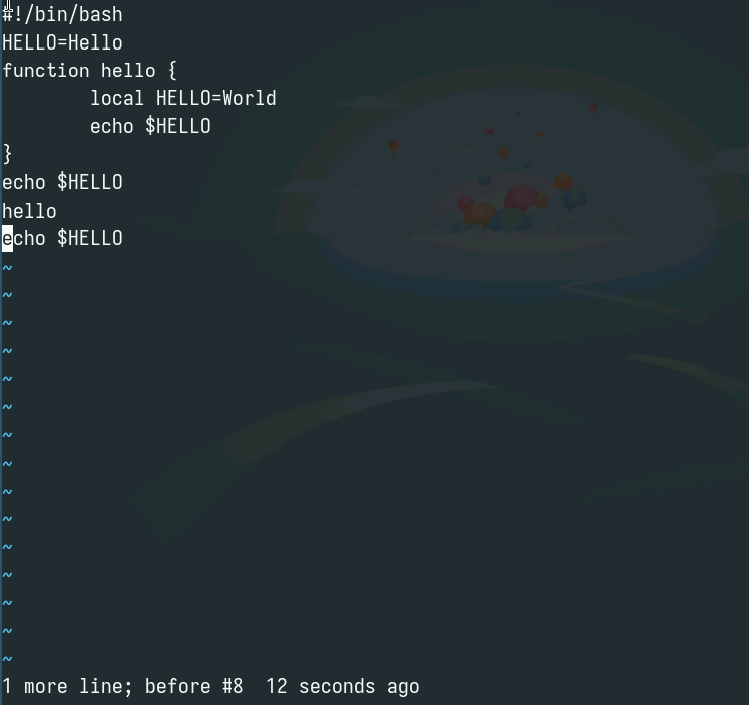

---
## Front matter
lang: ru-RU
title: Лабораторная работа 10
subtitle: Текстовый редактор vi
author:
  - Власов Артем Сергеевич
institute:
  - Российский университет дружбы народов, Москва, Россия
  - Объединённый институт ядерных исследований, Дубна, Россия
date: 19 апреля 2025

## i18n babel
babel-lang: russian
babel-otherlangs: english

## Formatting pdf
toc: false
toc-title: Содержание
slide_level: 2
aspectratio: 169
section-titles: true
theme: metropolis
header-includes:
 - \metroset{progressbar=frametitle,sectionpage=progressbar,numbering=fraction}
---

# Информация

## Докладчик

:::::::::::::: {.columns align=center}
::: {.column width="70%"}

  * Власов Артем Сергеевич
  * Группа НПИбд-01-24
  * Студент
  * Российский университет дружбы народов
  * [1132246841@pfur.ru](mailto:1132246841@pfur.ru)

## Цели и задачи

Познакомиться с операционной системой Linux. Получить практические навыки работы с редактором vi, установленным по умолчанию практически во всех дистрибутивах.

# Задание

Выполнить последовательность действий по заданному сценарию.
                                                    
# Выполнение лабораторной работы 10.

## СОздание и откртие файла в vi.

:::::::::::::: {.columns align=center}
::: {.column width="70%"}

{#fig:001 width=70%}

:::
::::::::::::::

## Вставка текста в файл с помощью vi.

:::::::::::::: {.columns align=center}
::: {.column width="70%"}

{#fig:002 width=70%}

:::
::::::::::::::

## Запись и выход из файла

:::::::::::::: {.columns align=center}
::: {.column width="70%"}

{#fig:003 width=70%}

:::
::::::::::::::

## Делаем файл исполняемым

:::::::::::::: {.columns align=center}
::: {.column width="70%"}

{#fig:004 width=70%}

:::
::::::::::::::

## Открытие файла в vi

:::::::::::::: {.columns align=center}
::: {.column width="70%"}

{#fig:005 width=70%}

:::
::::::::::::::

## Пишем HELLO вместо HELL

:::::::::::::: {.columns align=center}
::: {.column width="70%"}

{#fig:006 width=70%}

:::
::::::::::::::

## Удаляем слово LOCAL

:::::::::::::: {.columns align=center}
::: {.column width="70%"}

{#fig:007 width=70%}	

:::
::::::::::::::

## Пишем вмсето него local

:::::::::::::: {.columns align=center}
::: {.column width="70%"}

{#fig:008 width=70%}	

:::
::::::::::::::

## Переходим на последнюю строчку и пишем после нее еще одну

:::::::::::::: {.columns align=center}
::: {.column width="70%"}

{#fig:009 width=70%}

:::
::::::::::::::

## Удаление созданной строки

:::::::::::::: {.columns align=center}
::: {.column width="70%"}

{#fig:010 width=70%}

:::
::::::::::::::

## Отмена предыдущего действия(клавиша u)

:::::::::::::: {.columns align=center}
::: {.column width="70%"}

{#fig:011 width=70%}

:::
::::::::::::::

## Сохранение изменений.

:::::::::::::: {.columns align=center}
::: {.column width="70%"}

{#fig:012 width=70%}

:::
::::::::::::::

## Выводы
Мы освоили основные возможности текстового редактора vi, научились выполнять действия, используя горячие клавиши.
