---
## Front matter
lang: ru-RU
title: Лабораторная работа 11
subtitle: Текстовый редактор emacs
author:
  - Власов Артем Сергеевич
institute:
  - Российский университет дружбы народов, Москва, Россия
  - Объединённый институт ядерных исследований, Дубна, Россия
date: 26 апреля 2025

## i18n babel
babel-lang: russian
babel-otherlangs: english

## Formatting pdf
toc: false
toc-title: Содержание
slide_level: 2
aspectratio: 169
section-titles: true
theme: metropolis
header-includes:
 - \metroset{progressbar=frametitle,sectionpage=progressbar,numbering=fraction}
---

# Информация

## Докладчик

:::::::::::::: {.columns align=center}
::: {.column width="70%"}

  * Власов Артем Сергеевич
  * Группа НПИбд-01-24
  * Студент
  * Российский университет дружбы народов
  * [1132246841@pfur.ru](mailto:1132246841@pfur.ru)

## Цели и задачи

Познакомиться с операционной системой Linux. Получить практические навыки работы с редактором emacs.
# Задание

Выполнить последовательность действий по заданному сценарию.
                                                    
# Выполнение лабораторной работы 11.

## Создание и откртие файла в emacs

:::::::::::::: {.columns align=center}
::: {.column width="70%"}

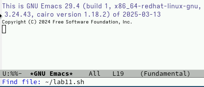{#fig:001 width=70%}

:::
::::::::::::::

## Заполенние текстового файла

:::::::::::::: {.columns align=center}
::: {.column width="70%"}

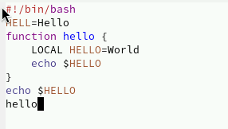{#fig:002 width=70%}

:::
::::::::::::::

## Вырезка строки и вставка в конец файла

:::::::::::::: {.columns align=center}
::: {.column width="70%"}

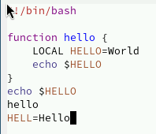{#fig:003 width=70%}

:::
::::::::::::::

## Копирование и вставка выделенной области

:::::::::::::: {.columns align=center}
::: {.column width="70%"}

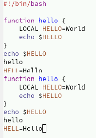{#fig:004 width=70%}

:::
::::::::::::::

## Вырезка области

:::::::::::::: {.columns align=center}
::: {.column width="70%"}

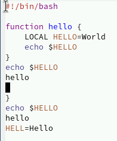{#fig:005 width=70%}

:::
::::::::::::::

## Отмена последнего действия

:::::::::::::: {.columns align=center}
::: {.column width="70%"}

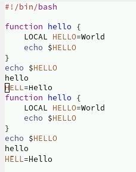{#fig:006 width=70%}

:::
::::::::::::::

## Перемещение курсора в начало и конец строки и буфера

:::::::::::::: {.columns align=center}
::: {.column width="70%"}

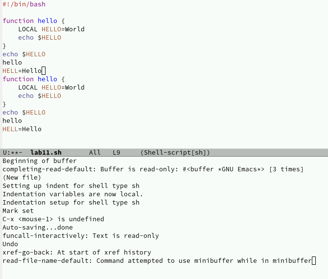{#fig:007 width=70%}

:::
::::::::::::::

## Список активных буферов, переключение между буферами и закрытие окна буфера

:::::::::::::: {.columns align=center}
::: {.column width="70%"}

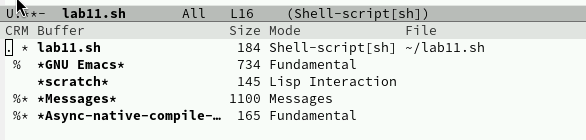{#fig:008 width=70%}	

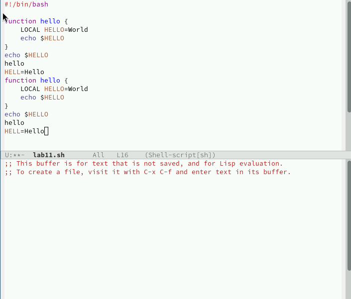{#fig:009 width=70%}

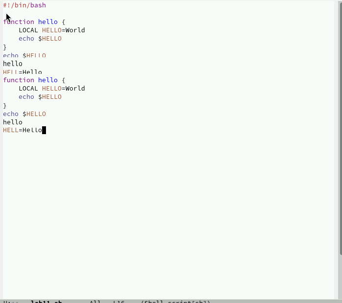{#fig:010 width=70%}

:::
::::::::::::::

## Переключение буферов комбинацией клавиш

:::::::::::::: {.columns align=center}
::: {.column width="70%"}

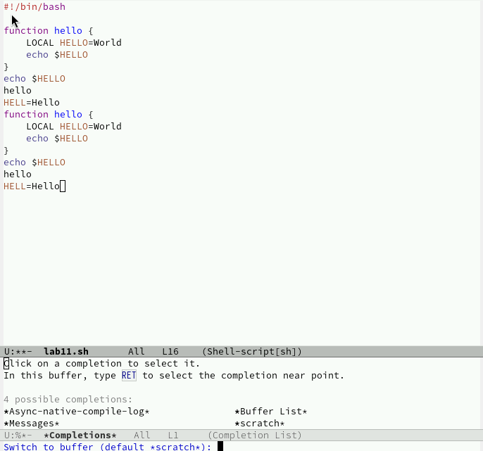{#fig:011 width=70%}

:::
::::::::::::::

## Разделение экрана на 4 части

:::::::::::::: {.columns align=center}
::: {.column width="70%"}

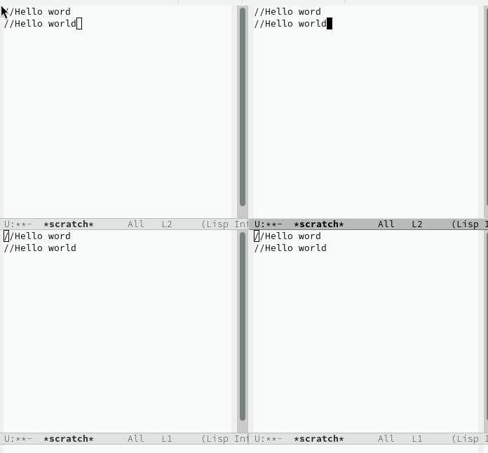{#fig:013 width=70%}
:::
::::::::::::::

## Поиск по файлу и переключение между результатами поиска

:::::::::::::: {.columns align=center}
::: {.column width="70%"}

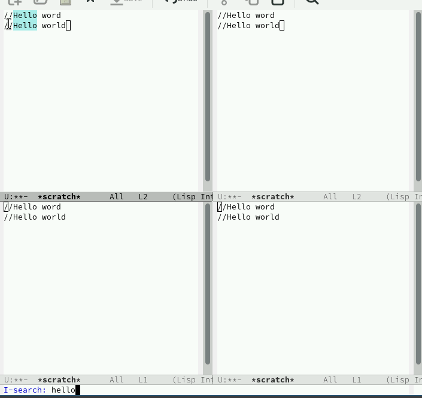{#fig:014 width=70%}

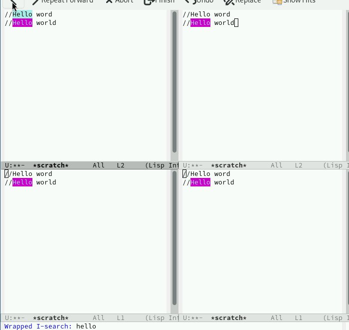{#fig:015 width=70%}

:::
::::::::::::::

## Найти и заменить

:::::::::::::: {.columns align=center}
::: {.column width="70%"}

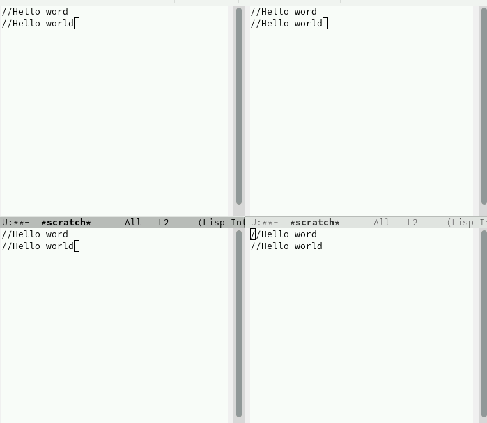{#fig:016 width=70%}

:::
::::::::::::::

## Поиск с помощью другого режима(показывает строки вхождения)

:::::::::::::: {.columns align=center}
::: {.column width="70%"}

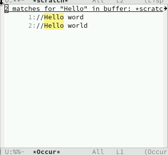{#fig:017 width=70%}

:::
::::::::::::::

## Выводы
Мы освоили основные возможности текстового редактора emacs, научились выполнять действия, используя горячие клавиши.
