---
## Front matter
title: "Отчет по лабораторной работе 11"
subtitle: "Текстовый редактор emacs"
author: "Власов Артем Сергеевич"

## Generic otions
lang: ru-RU
toc-title: "Содержание"
## Bibliography
bibliography: bib/cite.bib
csl: pandoc/csl/gost-r-7-0-5-2008-numeric.csl

## Pdf output format
toc: true # Table of contents
toc-depth: 2
lof: true # List of figures
lot: true # List of tables
fontsize: 12pt
linestretch: 1.5
papersize: a4
documentclass: scrreprt
## I18n polyglossia
polyglossia-lang:
  name: russian
  options:
    - spelling=modern
    - babelshorthands=true
polyglossia-otherlangs:
  name: english
## I18n babel
babel-lang: russian
babel-otherlangs: english
## Fonts
mainfont: IBM Plex Serif
romanfont: IBM Plex Serif
sansfont: IBM Plex Sans
monofont: IBM Plex Mono
mathfont: STIX Two Math
mainfontoptions: Ligatures=Common,Ligatures=TeX,Scale=0.94
romanfontoptions: Ligatures=Common,Ligatures=TeX,Scale=0.94
sansfontoptions: Ligatures=Common,Ligatures=TeX,Scale=MatchLowercase,Scale=0.94
monofontoptions: Scale=MatchLowercase,Scale=0.94,FakeStretch=0.9
mathfontoptions:
## Biblatex
biblatex: true
biblio-style: "gost-numeric"
biblatexoptions:
  - parentracker=true
  - backend=biber
  - hyperref=auto
  - language=auto
  - autolang=other*
  - citestyle=gost-numeric
## Pandoc-crossref LaTeX customization
figureTitle: "Рис."
tableTitle: "Таблица"
listingTitle: "Листинг"
lofTitle: "Список иллюстраций"
lotTitle: "Список таблиц"
lolTitle: "Листинги"
## Misc options
indent: true
header-includes:
  - \usepackage{indentfirst}
  - \usepackage{float} # keep figures where there are in the text
  - \floatplacement{figure}{H} # keep figures where there are in the text
---

# Цель работы

Познакомиться с операционной системой Linux. Получить практические навыки работы с редактором emacs.

# Задание

Выполнить последовательность действий по заданному сценарию.

# Выполнение лабораторной работы 11.

Создание и откртие файла в emacs. (рис. @fig:001).

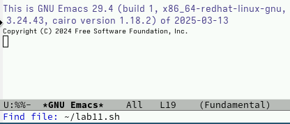{#fig:001 width=70%}

Заполенние текстового файла. (рис. @fig:002).

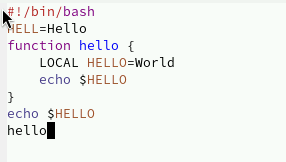{#fig:002 width=70%}

Вырезка строки и вставка в конец файла. (рис. @fig:003).

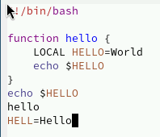{#fig:003 width=70%}

Копирование и вставка выделенной области. (рис. @fig:004).

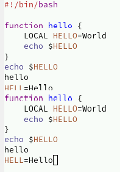{#fig:004 width=70%}

Вырезка области. (рис. @fig:005).

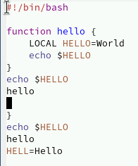{#fig:005 width=70%}

Отмена последнего действия. (рис. @fig:006).

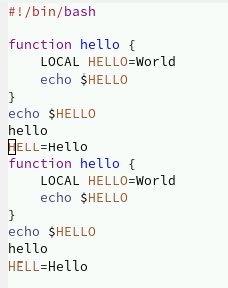{#fig:006 width=70%}

Перемещение курсора в начало и конец строки и буфера(рис. @fig:007).

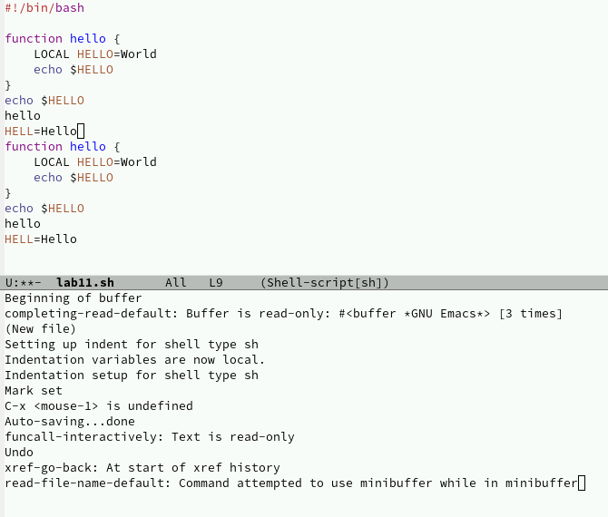{#fig:007 width=70%}

Список активных буферов(рис. @fig:008).

{#fig:008 width=70%}	

Переключение на другой буфер(рис. @fig:009).

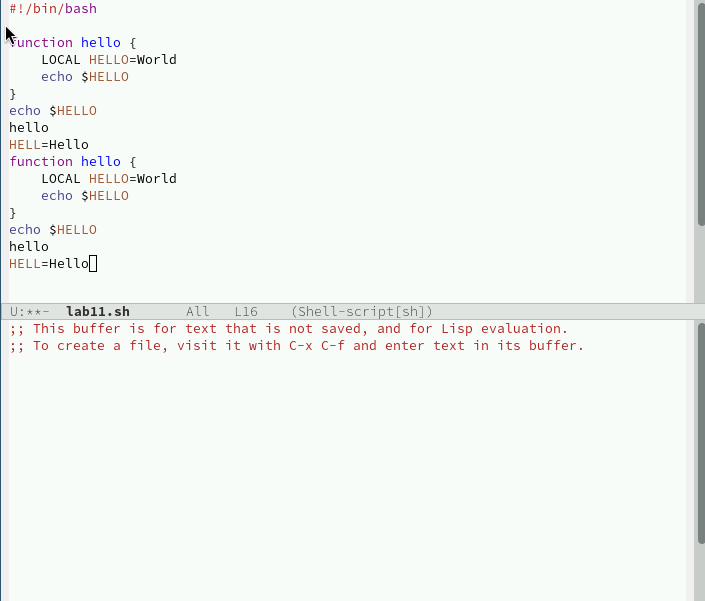{#fig:009 width=70%}

Закрытие окна буфера(рис. @fig:010).

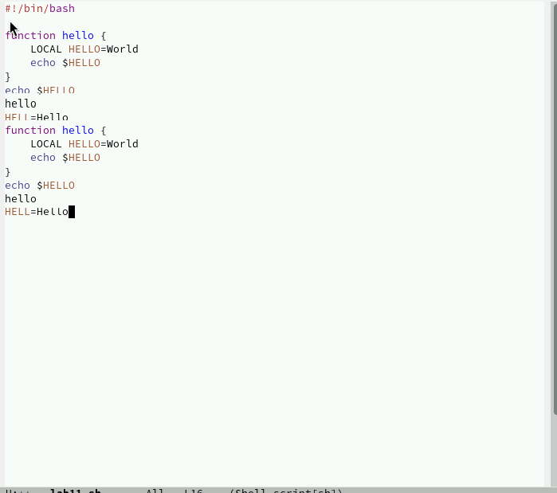{#fig:010 width=70%}

Переключение буферов комбинацией клавиш. (рис. @fig:011).

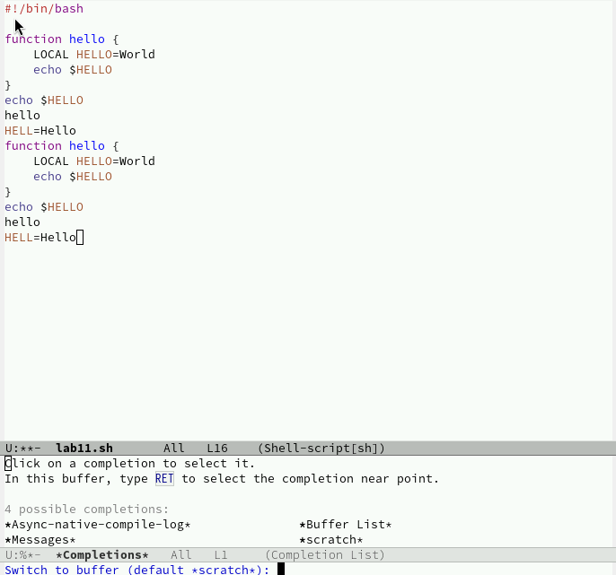{#fig:011 width=70%}

Разделение экрана на 4 части. (рис. @fig:013).

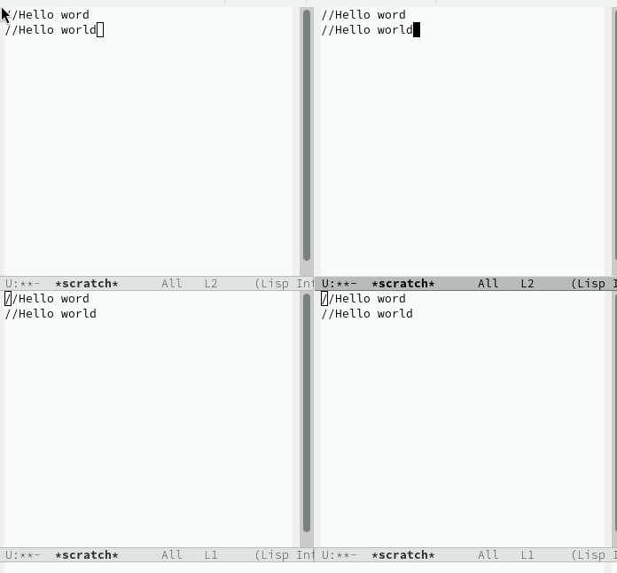{#fig:013 width=70%}

Поиск по файлу. (рис. @fig:014).

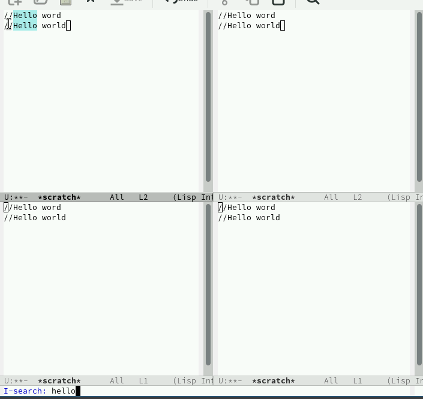{#fig:014 width=70%}

Переключение между результатами поиска. (рис. @fig:015).

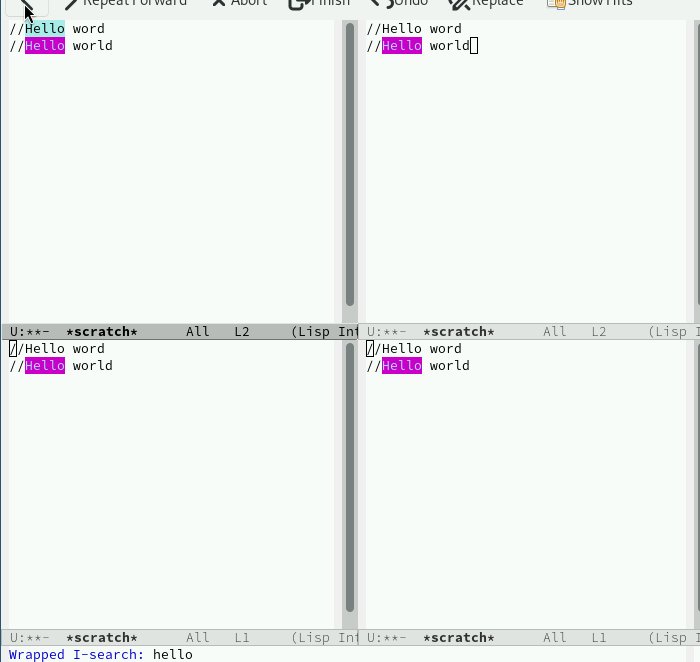{#fig:015 width=70%}

Найти и заменить. (рис. @fig:016).

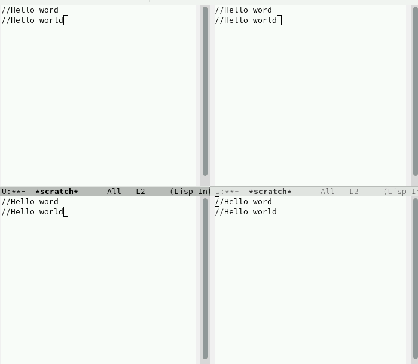{#fig:016 width=70%}

Поиск с помощью другого режима(показывает строки вхождения). (рис. @fig:017).

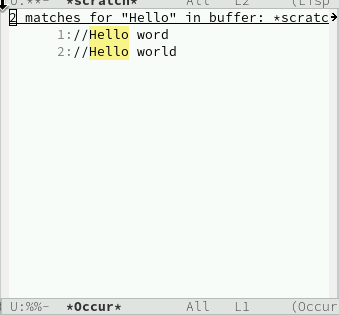{#fig:017 width=70%}
# Контрольные вопросы.

1 - Emacs — это мощный, расширяемый текстовый редактор с поддержкой множества языков программирования и возможностью настройки под нужды пользователя. Он включает встроенные инструменты для работы с файлами, буферами, а также поддержку различных режимов редактирования. 
2 - Сложность освоения Emacs для новичков может быть связана с нестандартными комбинациями клавиш, обилием функций и необходимостью изучения его терминологии (например, буферы, фреймы, окна). 
3 - Буфер в Emacs — это область памяти, где хранится текст (файл, результат команды и т. д.). Окно — это видимая часть буфера, отображаемая на экране. В одном окне можно просматривать несколько буферов, переключаясь между ними. 
4 - Да, в Emacs можно открыть больше 10 буферов в одном окне, ограничение зависит только от ресурсов системы. 
5 - При запуске Emacs по умолчанию создаются буферы: *scratch* (для временных записей), *Messages* (логи работы), а также буферы, связанные с настройками и справкой. 
6 - Для ввода комбинации C-c | нужно нажать Ctrl + c, а затем символ |. Для C-c | — аналогично, но символ | может потребовать дополнительного нажатия Shift в зависимости от раскладки клавиатуры. 
7 - Текущее окно можно поделить на две части по вертикали комбинацией C-x 3 или по горизонтали — C-x 2. 
8 - Настройки Emacs хранятся в файле ~/.emacs или ~/.emacs.d/init.el. 
9 - Клавиша ( ) в Emacs обычно используется для ввода круглых скобок. Её можно переназначить через конфигурационный файл. 
10 - Ответ на этот вопрос зависит от предпочтений пользователя. Например, Emacs удобен для программистов благодаря расширяемости, а другие редакторы (например, Nano) могут быть проще для новичков.

# Выводы

Мы освоили основные возможности текстового редактора emacs, научились выполнять действия, используя горячие клавиши.

# Список литературы{.unnumbered}

::: {#refs}
:::
