---
## Front matter
title: "Отчет по лабораторной работе 12"
subtitle: "Программирование в командном процессоре ОС UNIX. Командные файлы."
author: "Власов Артем Сергеевич"

## Generic otions
lang: ru-RU
toc-title: "Содержание"
## Bibliography
bibliography: bib/cite.bib
csl: pandoc/csl/gost-r-7-0-5-2008-numeric.csl

## Pdf output format
toc: true # Table of contents
toc-depth: 2
lof: true # List of figures
lot: true # List of tables
fontsize: 12pt
linestretch: 1.5
papersize: a4
documentclass: scrreprt
## I18n polyglossia
polyglossia-lang:
  name: russian
  options:
    - spelling=modern
    - babelshorthands=true
polyglossia-otherlangs:
  name: english
## I18n babel
babel-lang: russian
babel-otherlangs: english
## Fonts
mainfont: IBM Plex Serif
romanfont: IBM Plex Serif
sansfont: IBM Plex Sans
monofont: IBM Plex Mono
mathfont: STIX Two Math
mainfontoptions: Ligatures=Common,Ligatures=TeX,Scale=0.94
romanfontoptions: Ligatures=Common,Ligatures=TeX,Scale=0.94
sansfontoptions: Ligatures=Common,Ligatures=TeX,Scale=MatchLowercase,Scale=0.94
monofontoptions: Scale=MatchLowercase,Scale=0.94,FakeStretch=0.9
mathfontoptions:
## Biblatex
biblatex: true
biblio-style: "gost-numeric"
biblatexoptions:
  - parentracker=true
  - backend=biber
  - hyperref=auto
  - language=auto
  - autolang=other*
  - citestyle=gost-numeric
## Pandoc-crossref LaTeX customization
figureTitle: "Рис."
tableTitle: "Таблица"
listingTitle: "Листинг"
lofTitle: "Список иллюстраций"
lotTitle: "Список таблиц"
lolTitle: "Листинги"
## Misc options
indent: true
header-includes:
  - \usepackage{indentfirst}
  - \usepackage{float} # keep figures where there are in the text
  - \floatplacement{figure}{H} # keep figures where there are in the text
---

# Цель работы

Изучить основы программирования в оболочке ОС UNIX. Научиться писать небольшие командные файлы.

# Задание

Выполнить последовательность действий по заданному сценарию, написать 4 скрипта для разных целей.

# Выполнение лабораторной работы 12.

Создание файла первого скрипта и изменение его прав доступа. (рис. @fig:001).

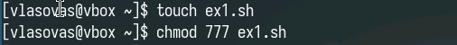{#fig:001 width=70%}

Код первого скрипта(бэкап в архиве). (рис. @fig:002).

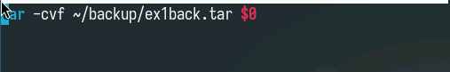{#fig:002 width=70%}

Проверка работы первого скрипта. (рис. @fig:003).

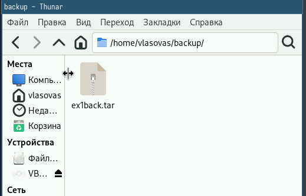{#fig:003 width=70%}

Создание файла второго скрипта и изменение его прав доступа. (рис. @fig:004).

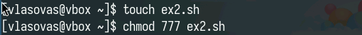{#fig:004 width=70%}

Код второго скрипта(вывод аргументов). (рис. @fig:005).

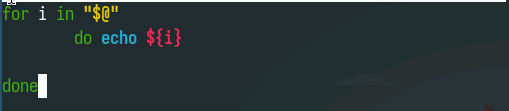{#fig:005 width=70%}

Проверка работы второго скрипта. (рис. @fig:006).

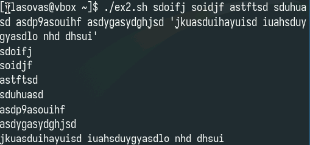{#fig:006 width=70%}

Создание файла третьего скрипта и изменение его прав доступа. (рис. @fig:007).

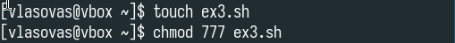{#fig:007 width=70%}

Код третьего скрипта(файлы каталога и их права доступа) (рис. @fig:008).

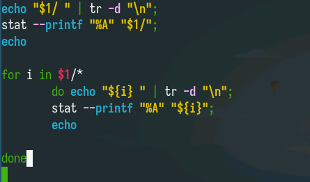{#fig:008 width=70%}	

Проверка работа третьего скрипта(рис. @fig:009).

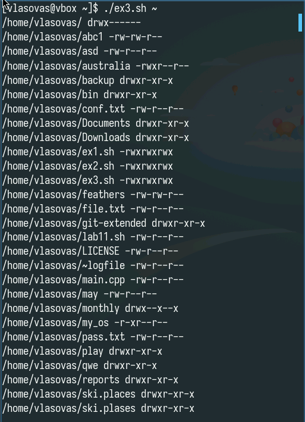{#fig:009 width=70%}

Создание файла четвертого скрипта и изменение его прав доступа.(рис. @fig:010).

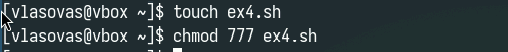{#fig:010 width=70%}

Код четвертого скрипта(количество файлов с заданным расширением). (рис. @fig:011).

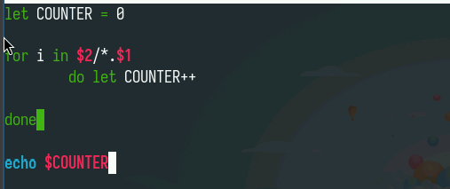{#fig:011 width=70%}

Проверка работы четвертого скрипта. (рис. @fig:012).

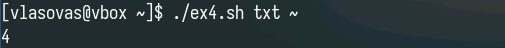{#fig:012 width=70%}

# Контрольные вопросы

Командная оболочка - это интерпретатор команд, обеспечивающий взаимодействие пользователя с операционной системой, примеры: Bash, Zsh, Ksh. 
POSIX - это стандарт, обеспечивающий совместимость между UNIX-подобными операционными системами. 
В Bash переменные объявляются как VAR="значение", массивы - ARR=("val1" "val2") или declare -A DICT=(["key"]="value"). 
Оператор let выполняет арифметические вычисления, а read используется для ввода данных пользователем. 
Bash поддерживает арифметические операции: +, -, *, /, %, **, ++, --. 
Конструкция (( )) предназначена для выполнения арифметических операций и сравнений. 
Стандартные переменные включают $HOME, $PATH, $USER, $PWD, $?, $$. 
Метасимволы - это специальные символы (*, ?, >, |, & и др.), имеющие особое значение в shell. 
Экранировать метасимволы можно с помощью обратного слэша \ или кавычек. 
Скрипты создаются как файлы .sh, делаются исполняемыми через chmod +x и запускаются ./script.sh. 
Функции определяются как name() { команды } или function name { команды }. 
Тип файла проверяется операторами -f (обычный файл) и -d (каталог). 
Команда set управляет параметрами shell, typeset задает атрибуты переменных, unset удаляет переменные. 
Параметры передаются через $1, $2..., $@ (все аргументы), $# (количество аргументов). 
Специальные переменные включают $0 (имя скрипта), $! (PID фонового процесса), $_ (последний аргумент).
	
# Выводы

Мы изучили основы программирования в оболочке ОС UNIX. Научились писать небольшие командные файлы.

# Список литературы{.unnumbered}

::: {#refs}
:::
