---
## Front matter
title: "Отчет по лабораторной работе 13"
subtitle: "Программирование в командном процессоре ОС UNIX. Ветвления и циклы."
author: "Власов Артем Сергеевич"

## Generic otions
lang: ru-RU
toc-title: "Содержание"
## Bibliography
bibliography: bib/cite.bib
csl: pandoc/csl/gost-r-7-0-5-2008-numeric.csl

## Pdf output format
toc: true # Table of contents
toc-depth: 2
lof: true # List of figures
lot: true # List of tables
fontsize: 12pt
linestretch: 1.5
papersize: a4
documentclass: scrreprt
## I18n polyglossia
polyglossia-lang:
  name: russian
  options:
    - spelling=modern
    - babelshorthands=true
polyglossia-otherlangs:
  name: english
## I18n babel
babel-lang: russian
babel-otherlangs: english
## Fonts
mainfont: IBM Plex Serif
romanfont: IBM Plex Serif
sansfont: IBM Plex Sans
monofont: IBM Plex Mono
mathfont: STIX Two Math
mainfontoptions: Ligatures=Common,Ligatures=TeX,Scale=0.94
romanfontoptions: Ligatures=Common,Ligatures=TeX,Scale=0.94
sansfontoptions: Ligatures=Common,Ligatures=TeX,Scale=MatchLowercase,Scale=0.94
monofontoptions: Scale=MatchLowercase,Scale=0.94,FakeStretch=0.9
mathfontoptions:
## Biblatex
biblatex: true
biblio-style: "gost-numeric"
biblatexoptions:
  - parentracker=true
  - backend=biber
  - hyperref=auto
  - language=auto
  - autolang=other*
  - citestyle=gost-numeric
## Pandoc-crossref LaTeX customization
figureTitle: "Рис."
tableTitle: "Таблица"
listingTitle: "Листинг"
lofTitle: "Список иллюстраций"
lotTitle: "Список таблиц"
lolTitle: "Листинги"
## Misc options
indent: true
header-includes:
  - \usepackage{indentfirst}
  - \usepackage{float} # keep figures where there are in the text
  - \floatplacement{figure}{H} # keep figures where there are in the text
---

# Цель работы

Изучить основы программирования в оболочке ОС UNIX. Научиться писать небольшие командные файлы с ветвлениями и циклами.

# Задание

Выполнить последовательность действий по заданному сценарию, написать 4 скрипта для разных целей.

# Выполнение лабораторной работы 13.

Создание файла первого скрипта и изменение его прав доступа. (рис. @fig:001).

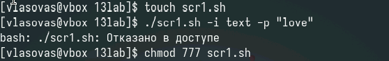{#fig:001 width=70%}

Код первого скрипта. (рис. @fig:002).

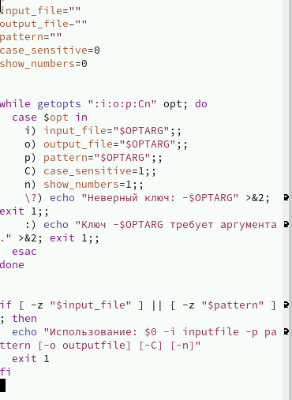{#fig:002 width=70%}

Проверка работы первого скрипта. (рис. @fig:003).

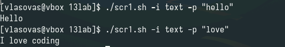{#fig:003 width=70%}

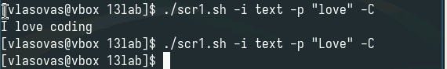{#fig:004 width=70%}

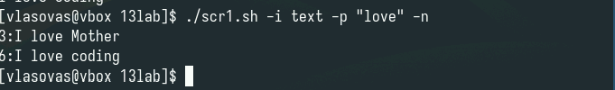{#fig:005 width=70%}

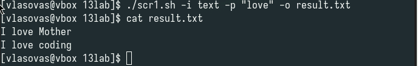{#fig:006 width=70%}

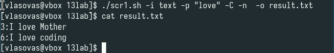{#fig:007 width=70%}

Код второго скрипта на С (рис. @fig:008).

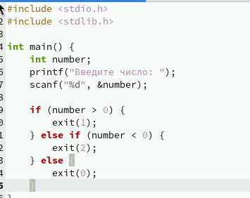{#fig:008 width=70%}

Код второго скрипта(коммандный файл). (рис. @fig:009).

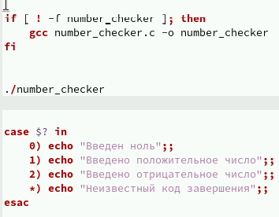{#fig:010 width=70%}

Проверка работы второго скрипта. (рис. @fig:011).

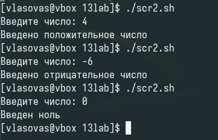{#fig:012 width=70%}

Код третьего скрипта (рис. @fig:013).

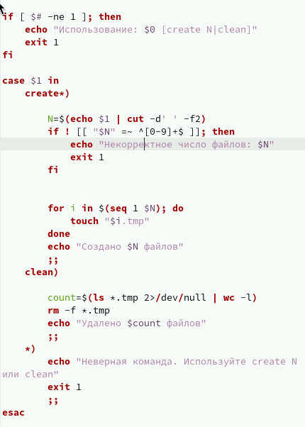{#fig:013 width=70%}	

Проверка работа третьего скрипта(рис. @fig:014).

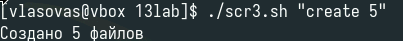{#fig:015 width=70%}

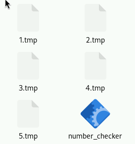{#fig:016 width=70%}

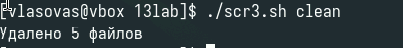{#fig:017 width=70%}

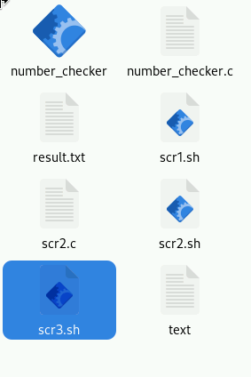{#fig:018 width=70%}

Код четвертого скрипта. (рис. @fig:019).

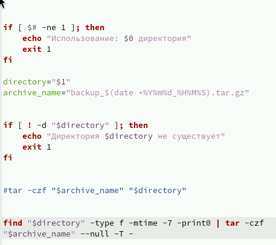{#fig:019 width=70%}

Проверка работы четвертого скрипта. (рис. @fig:020).

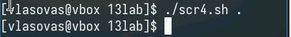{#fig:020 width=70%}

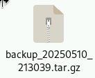{#fig:021 width=70%}

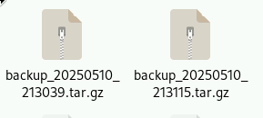{#fig:022 width=70%}

# Контрольные вопросы

1. getopts 
   Обрабатывает аргументы командной строки в скриптах.

2. Метасимволы 
   (*, ?, {}, []) автоматизируют генерацию имён файлов по шаблону.

3. Операторы управления 
   if-else, case, for, while, until, break, continue.

4. Прерывание циклов 
   break - прерывает цикл, continue - пропускает итерацию.

5. true/false 
   true возвращает 0 (успех), false возвращает 1 (ошибка) для управления выполнением.

6. Проверка файла 
   if test -f marks/${i}.$s проверяет существование файла с именем из переменных в папке marks.

7. while vs until 
   while выполняется пока условие истинно, until - пока ложно.
	
# Выводы

Мы изучили основы программирования в оболочке ОС UNIX. Научились писать небольшие командные файлы с ветвлениями и циклами.

# Список литературы{.unnumbered}

::: {#refs}
:::
