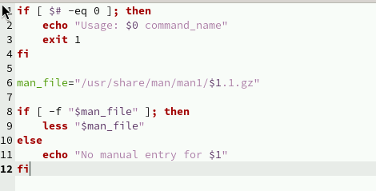

---
## Front matter
lang: ru-RU
title: Лабораторная работа 14
subtitle: Программирование в командном процессоре ОС UNIX. Расширенное программирование.
author:
  - Власов Артем Сергеевич
institute:
  - Российский университет дружбы народов, Москва, Россия
  - Объединённый институт ядерных исследований, Дубна, Россия
date: 15 мая 2025

## i18n babel
babel-lang: russian
babel-otherlangs: english

## Formatting pdf
toc: false
toc-title: Содержание
slide_level: 2
aspectratio: 169
section-titles: true
theme: metropolis
header-includes:
 - \metroset{progressbar=frametitle,sectionpage=progressbar,numbering=fraction}
---

# Информация

## Докладчик

:::::::::::::: {.columns align=center}
::: {.column width="70%"}

  * Власов Артем Сергеевич
  * Группа НПИбд-01-24
  * Студент
  * Российский университет дружбы народов
  * [1132246841@pfur.ru](mailto:1132246841@pfur.ru)

## Цели и задачи

Изучить основы программирования в оболочке ОС UNIX. Научиться писать командные файлы.

# Задание

Выполнить последовательность действий по заданному сценарию, написать 3 скрипта для разных целей.
                                                    
# Выполнение лабораторной работы 14.

## Создание файла первого скрипта и изменение его прав доступа.

:::::::::::::: {.columns align=center}
::: {.column width="70%"}

{#fig:001 width=70%}

:::
::::::::::::::

## Код первого скрипта

:::::::::::::: {.columns align=center}
::: {.column width="70%"}

{#fig:002 width=70%}

{#fig:003 width=70%}

:::
::::::::::::::

## Код второго скрипта

:::::::::::::: {.columns align=center}
::: {.column width="70%"}

{#fig:004 width=70%}

{#fig:005 width=70%}

:::
::::::::::::::

## Результат работы второго скрипта

:::::::::::::: {.columns align=center}
::: {.column width="70%"}

{#fig:006 width=70%}

:::
::::::::::::::

## Код третьего скрипта

:::::::::::::: {.columns align=center}
::: {.column width="70%"}

{#fig:007 width=70%}
	
:::
::::::::::::::

## Проверка работы третьего скрипта

:::::::::::::: {.columns align=center}
::: {.column width="70%"}

{#fig:009 width=70%}
	
:::
::::::::::::::

## Выводы
Мы изучили основы программирования в оболочке ОС UNIX. Научились писать расширенные командные файлы.
