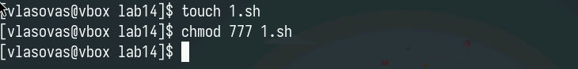
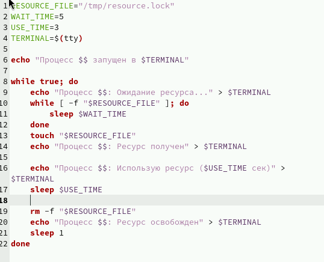
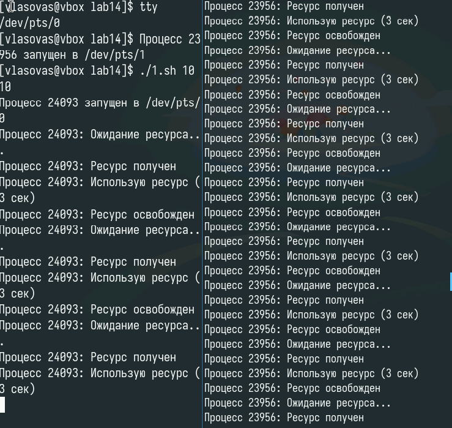
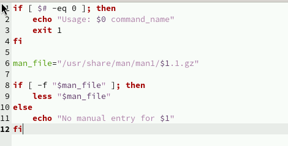
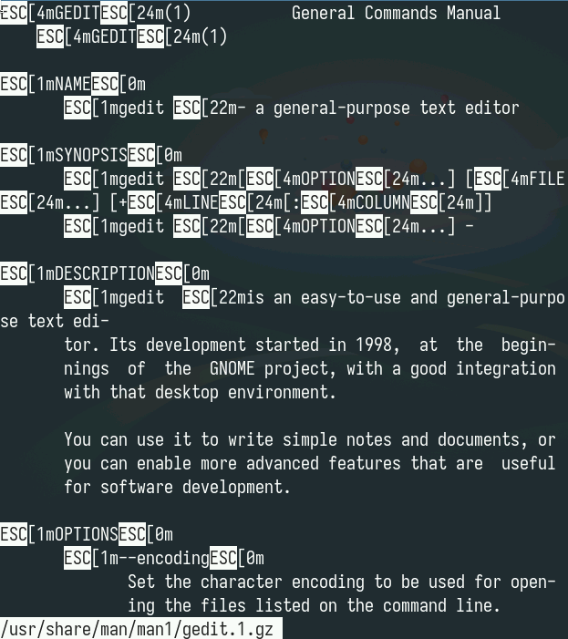
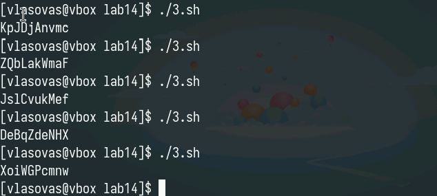

---
## Front matter
title: "Отчет по лабораторной работе 14"
subtitle: "Программирование в командном процессоре ОС UNIX. Расширенное программирование."
author: "Власов Артем Сергеевич"

## Generic otions
lang: ru-RU
toc-title: "Содержание"
## Bibliography
bibliography: bib/cite.bib
csl: pandoc/csl/gost-r-7-0-5-2008-numeric.csl

## Pdf output format
toc: true # Table of contents
toc-depth: 2
lof: true # List of figures
lot: true # List of tables
fontsize: 12pt
linestretch: 1.5
papersize: a4
documentclass: scrreprt
## I18n polyglossia
polyglossia-lang:
  name: russian
  options:
    - spelling=modern
    - babelshorthands=true
polyglossia-otherlangs:
  name: english
## I18n babel
babel-lang: russian
babel-otherlangs: english
## Fonts
mainfont: IBM Plex Serif
romanfont: IBM Plex Serif
sansfont: IBM Plex Sans
monofont: IBM Plex Mono
mathfont: STIX Two Math
mainfontoptions: Ligatures=Common,Ligatures=TeX,Scale=0.94
romanfontoptions: Ligatures=Common,Ligatures=TeX,Scale=0.94
sansfontoptions: Ligatures=Common,Ligatures=TeX,Scale=MatchLowercase,Scale=0.94
monofontoptions: Scale=MatchLowercase,Scale=0.94,FakeStretch=0.9
mathfontoptions:
## Biblatex
biblatex: true
biblio-style: "gost-numeric"
biblatexoptions:
  - parentracker=true
  - backend=biber
  - hyperref=auto
  - language=auto
  - autolang=other*
  - citestyle=gost-numeric
## Pandoc-crossref LaTeX customization
figureTitle: "Рис."
tableTitle: "Таблица"
listingTitle: "Листинг"
lofTitle: "Список иллюстраций"
lotTitle: "Список таблиц"
lolTitle: "Листинги"
## Misc options
indent: true
header-includes:
  - \usepackage{indentfirst}
  - \usepackage{float} # keep figures where there are in the text
  - \floatplacement{figure}{H} # keep figures where there are in the text
---

# Цель работы

Изучить основы программирования в оболочке ОС UNIX. Научиться писать командные файлы.

# Задание

Выполнить последовательность действий по заданному сценарию, написать 3 скрипта для разных целей.

# Выполнение лабораторной работы 14.

Создание файла первого скрипта и изменение его прав доступа. (рис. @fig:001).

{#fig:001 width=70%}

Код первого скрипта(бэкап в архиве). (рис. @fig:002).

{#fig:002 width=70%}

Проверка работы первого скрипта. (рис. @fig:003).

{#fig:003 width=70%}

Код второго скрипта (рис. @fig:004).

{#fig:004 width=70%}

Запуск второго скрипта. (рис. @fig:005).

{#fig:005 width=70%}

Результат работы второго скрипта. (рис. @fig:006).

{#fig:006 width=70%}

Код третьего скрипта (рис. @fig:007).

{#fig:007 width=70%}
	
Проверка работа третьего скрипта(рис. @fig:009).

{#fig:009 width=70%}

# Контрольные вопросы

## 1. Синтаксическая ошибка

В строке while [$1 != "exit"] отсутствуют обязательные пробелы внутри квадратных скобок и кавычки для переменной. Правильная форма: while [ "$1" != "exit" ].

## 2. Конкатенация строк

Объединение строк выполняется через простое соположение: result="$str1$str2". Для надежности рекомендуется заключать переменные в фигурные скобки: result="${str1}${str2}".

## 3. Утилита seq

Альтернативы генерации числовых последовательностей:
- Цикл с фиксированными параметрами
- Арифметический цикл for
- Команда printf с диапазонами

## 4. Вычисление выражения

Выражение содержит некорректный синтаксис. Для целочисленного деления в bash используется конструкция $((10/3)), что дает результат 3.

## 5. Отличия zsh от bash

Ключевые различия включают расширенные возможности автодополнения, поддержку более сложных шаблонов поиска файлов и встроенную арифметику с плавающей точкой в zsh.

## 6. Проверка синтаксиса

Представленная конструкция содержит три ошибки: отсутствие пробела вокруг оператора сравнения, опечатку в имени переменной и лишнюю закрывающую скобку.

## 7. Сравнение языков

Bash оптимален для системного администрирования, но уступает универсальным языкам в вычислительной эффективности и поддерживаемых структурах данных. Основное преимущество - глубокая интеграция с shell-окружением.
	
# Выводы

Мы изучили основы программирования в оболочке ОС UNIX. Научились писать расширенные командные файлы.

# Список литературы{.unnumbered}

::: {#refs}
:::
