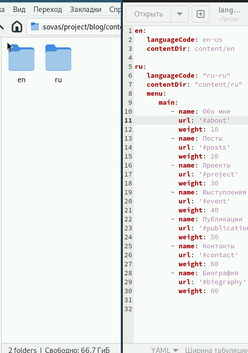

---
## Front matter
lang: ru-RU
title: Индивидуальный проект
subtitle: Шестой этап
author:
  - Власов Артем Сергеевич
institute:
  - Российский университет дружбы народов, Москва, Россия
  - Объединённый институт ядерных исследований, Дубна, Россия
date: 31 мая 2025

## i18n babel
babel-lang: russian
babel-otherlangs: english

## Formatting pdf
toc: false
toc-title: Содержание
slide_level: 2
aspectratio: 169
section-titles: true
theme: metropolis
header-includes:
 - \metroset{progressbar=frametitle,sectionpage=progressbar,numbering=fraction}
---

# Информация

## Докладчик

:::::::::::::: {.columns align=center}
::: {.column width="70%"}

  * Власов Артем Сергеевич
  * Группа НПИбд-01-24
  * Студент
  * Российский университет дружбы народов
  * [1132246841@pfur.ru](mailto:1132246841@pfur.ru)

## Цели и задачи

Перевести сайт на англйиский язык, добавить пост по прошедшей неделе и пост на тему по выбору.

# Задание

Сделать 2 поста и страницу на английском языке
                                                    
# Выполнение 6 этапа.

## Создаем две папки для разных языков и закидываем туда локализаторы, меняем код языкового конфига

:::::::::::::: {.columns align=center}
::: {.column width="70%"}

{#fig:001 width=70%}
:::
::::::::::::::

## Проверка работы переключения языков.

:::::::::::::: {.columns align=center}
::: {.column width="70%"}

{#fig:002 width=70%}

:::
::::::::::::::

## Два поста(по прошедшей неделе и на тему по выбору).

:::::::::::::: {.columns align=center}
::: {.column width="70%"}

{#fig:003 width=70%}

:::
::::::::::::::

## Проверка работы сайта после перевода всех его элемен тов(русский язык)

:::::::::::::: {.columns align=center}
::: {.column width="70%"}

{#fig:004 width=70%}

:::
::::::::::::::

## Проверка работы сайта после перевода всех его элемен тов(Английский язык)

:::::::::::::: {.columns align=center}
::: {.column width="70%"}

{#fig:005 width=70%}

:::
::::::::::::::

## Выводы
Мы перевели наш сайт на английский язык и добавили два новых поста.
